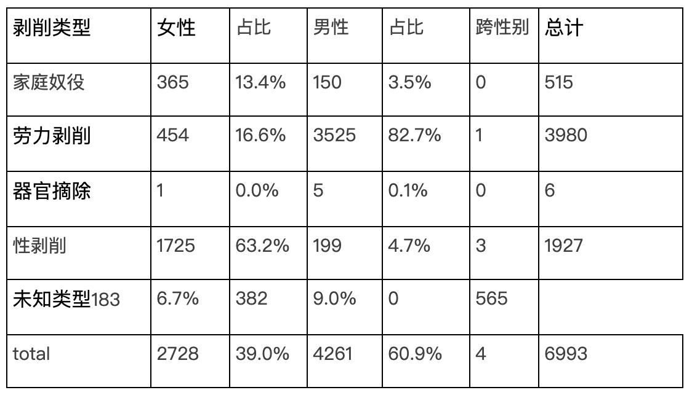
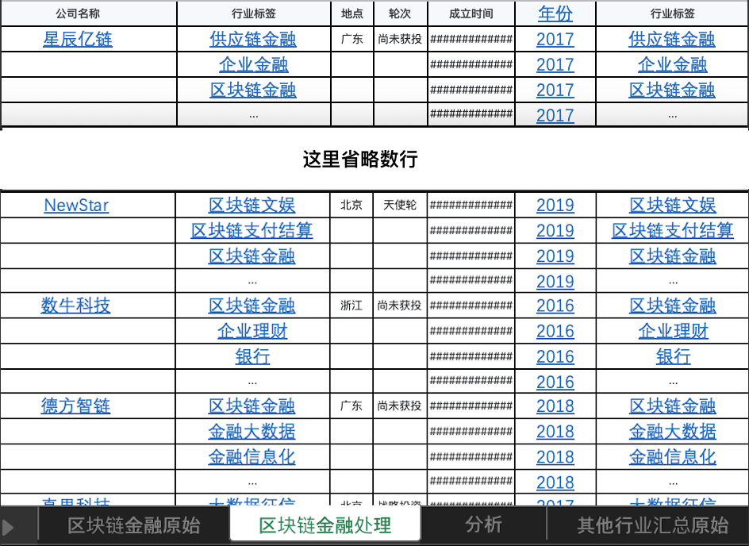
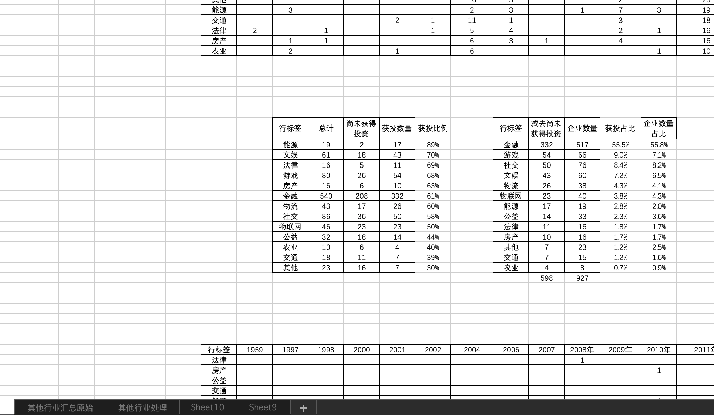

#01
##.violet[复用、合作、审核：]
##交接给他人的文档应该是什么样的？

---

###内容

Excel文档中应该包含：
- .violet[**原始数据表**]
  - 没有任何改动
  - 标明来源链接
  - 或数据获取方式、解锁条件
  - 或数据爬取过程、条件方法
  - 如属于个人自带数据库，则附上截图，或帐号密码

---

- .violet[**处理流程表**]
  - 操作的公式、数据透视表
  - 筛选、删改过程，或分类原则  
  （例，重复条目的归并用的什么原则？）
  - 可以引用了原始数据表
  - .yellow[**遇到政治问题得谨慎、谨慎、再谨慎！**]  
  （例，涉及国家主权、海外领地的数据）

--

- .violet[**汇总数据表**]

---

###命名

- 文件名包含日期和主题，命名方式：
  - 启动日期-甲方-项目-修改时间戳及版本号
  - .violet[20191031-央视网-中国时刻8文案-20191104V3]

--

- 如果有多个工作表，工作表命名要易于理解，如：
  - 01-原始数据
  - 01-处理数据
  - 01-汇总数据

--

- 不含特殊字符、空格

---
#02
##平时该养成哪些
##.yellow[良好的] Excel 使用习惯？

---

###规范性问题

.yellow[**统一格式**]
- 处理时先统一字体字号、对齐方式

--

- 统一数字格式，包括小数点位数等  

--

- 统一行、列间距

---

.yellow[**数据处理习惯**]

- 公式书写前后一致，如：  
不同时存在 .yellow[=sum(A2+A3+A4)] 和 .violet[=sum(A2:A4)]

--

- 处理数据时，可以.violet[**增加序号列**]，方便找出删改处

--

- 数值不是文本格式，数值列标题应指明数值单位

--

- 表格中无合并单元格、无手动计算

--

- 警惕空值和空格问题
  - 判断是否为空值：.yellow[ISBLANK()]
  - 快速去掉**字符串中的空格**：  
.yellow[TRIM(范围)]，去掉字符串前后的空格  
.violet[SUBSTITUTE(范围," ","")]，去掉单元格里的所有空格

---
.yellow[**数据处理习惯**]

- “列”对应**变量**，“行”对应信息录入

--

- 每列只对应一个变量，每格只对应一个信息

---
.yellow[**数据处理习惯**]

- 一个工作簿内，尽量不要有过多工作表  
.violet[不同主题可以存成新工作簿]

--

- 同一张工作表内，尽量不要有多个表格  
  
如果有，.violet[也应该排列整齐干净]，让人一目了然

---
#03
##Excel 有哪些.violet[基础知识]？

---

.pull-left[

**一些快捷键**
- 移动到数据区域的边缘：.yellow[Ctrl/Command + 箭头]
- 选定整张工作表：  
.yellow[Ctrl/Command + A]
- 选定整列：.yellow[Ctrl/Command + 空格]
- 选定整行：.yellow[Shift + 空格]
- 在单元格中换行：.yellow[Alt + 回车]
- 自动填充：  
挪到单元格右下角，双击 .yellow[+] 号
]

--

.pull-right[
**一些公式**
- 单元格绝对引用：.violet[$]
- CONCATENATE()
- .yellow[COUNT()]，统计数值单元格个数  
.violet[COUNTA()]，统计非空单元格个数
- .yellow[LEN()]，统计字符个数  
.violet[LENB()]，统计字节个数（中文计算为2个字节）
- LEFT(), RIGHT()
- YEAR(), MONTH(), DAY()
- TODAY(), NOW()
- WORKDAY(日期,工作日天数,排除的特殊假期)

]

---

.violet[**数据缺失**]：“0”和“空白”的差异

---

###Excel 的局限性

- 打开的工作簿个数：受可用内存、系统限制

--

- 工作簿中的工作表个数：受可用内存限制

--

- 工作表的总行数、列数：.yellow[1,048,576 行 x 16,384 列]

--

- 工作表的数据透视表个数：受可用内存限制

--

- 计算允许的最早日期：.yellow[1900 年 1 月 1 日]  
（如果使用 1904 年日期系统，则为 1904 年 1 月 1 日）  
计算允许的最晚日期：.yellow[9999 年 12 月 31 日]

--

- 数字精度：.yellow[15] 位

--

- 图表引用的工作表个数：.yellow[255]

--

更多参阅：[官方文档](https://support.office.com/zh-cn/article/excel-%E8%A7%84%E8%8C%83%E4%B8%8E%E9%99%90%E5%88%B6-1672b34d-7043-467e-8e27-269d656771c3)

---
#04
##.yellow[Excel Checklist：]数据交接

1. 检查文件、工作表命名：能否方便他人快速定位
2. 检查是否包括了原始数据及其链接
3. 检查处理后数据的格式是否统一
