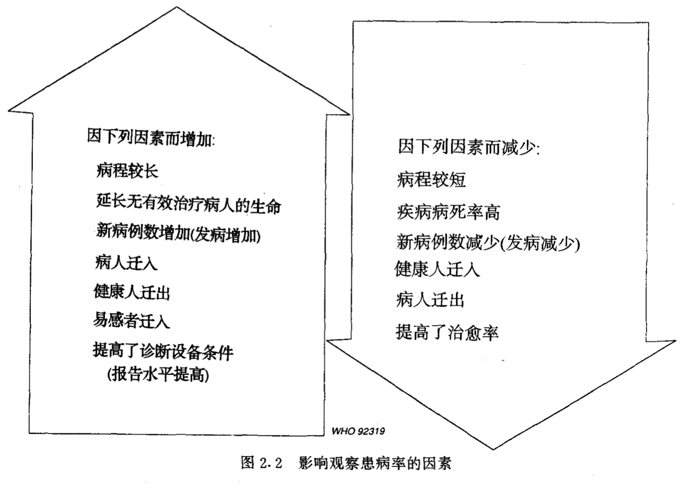

来源：[WHO：《基础流行病学》](https://apps.who.int/iris/bitstream/handle/10665/1624/7117023244_CHI.pdf?sequence=1&isAllowed=y)

### 基本概念
> <b>危险人群 Population at risk：</b>对疾病易感的那部分人被称之为危险人群
>
> <b>患病 Prevalence：</b>某特定人群在某特定时刻的患者人数
>
> <b>发病 Incidence：</b>某特定人群在某特定时期内的新病例数

患病与发病之间的关系在不同的病种之间是不同的：  
对于糖尿病来说，患病可以很高但发病则很低；而对感冒而言，则正相反，表现为患病低而发病高。

如果把患病和发病的数据转换成率则会成为更加有用的资料。  
率的计算是将病例数除以相应的危险人口数，用n个人中的病例数来表达。

> <b>患病率 Prevalence rate：</b>  
> P = 某时间内具有疾病或情况的人数 / 该时间内危险人群的人口数 * 10的n次方

有关危险人群的资料往往不能得到。  
在许多研究中，通常使用研究地区内的总人口作为近似的危险人群人口数。  
患病率常使用每1000人或100人中的病例数。

如果资料是在一个时点上收集的数据，P是“时点患病率”。有时使用"期间患病率"更为方便。  
计算可用某一特定时间内一直患病或任何一时点有病的总病例数，被同一时间区间内全部危险人群的人口数或中期人口数去除。

几种因素可影响患病率，特别是:
- 疾病的严重程度(如果患者中许多人死亡，则患病率是低的)
- 疾病的病程(如果疾病的病程短，则患病率比长病程的病要低) 
- 新病例数(如果许多人都产生某种疾病，则其患病率比只有少数人得病的疾病要高)

> <b>发病率 Incidence rate：</b>  
> I = 在该时间内所发生的新病例数（即发病人数） / 危险人群中每个人乘以观察时间的总和 * 10的n次方
>
> <b>累积发病率或危险性 Cumulative incidence rate or risk</b>

严格来说分子仅指那些初次患病者，发病率的单位须始终包含时间（如天、月、年等）。  
计算发病率的分母是在定义的研究期间内所有被观察者无病时间单位的总和。

> <b>病死率 Case-fatality：</b>  
> 病死率 % = 特定时间内因某病死亡人数 / 同期内诊断的病例总数 * 100

患病率取决于发病率和病程。当患病率是低的且不随时间而显著变动时，患病率可按下述公式做近似的计算：  
P = 发病率 x 疾病的平均病程

累积发病率取决于发病率和观察时间长短。  
由于发病率通常随年龄而变化，因而常常使用年龄专率。  
假若发病率低且观察时间短时，累积发病率是发病率的一种很好的近似值。

> <b>死亡率 Mortality：</b>  
> 粗死亡率 = 特定时间内死亡人数 / 同期平均总人口数 * 10的n次方

死因编码：使用国际上统一的分类标准，对死因进行编码的方法可查阅`国际疾病分类（International classification of diseases）`。

粗死亡率的主要缺点表现在未考虑到年龄性别、种族、社会经济收入及其他一些因素对死亡机会的影响，具有上述不同特征人群的死亡率是不同的。  
因而粗死亡率不宜用于对不同时间或不同地区进行比较。

- <b>年龄和性别死亡专率 Sex-specific death rate：</b>  
某地某时间内特定年龄性别组人口中死亡总数 / 该地该时间同一年龄性别组估计总人口数 * 10的n次方
- <b>出生前及刚出生后的死亡率 Mortality before and just after birth</b>  
- 婴儿死亡率、儿童死亡率、产妇死亡率
- 标化率 Standardized rates：  
年龄标化死亡率（也称年龄调整率）是总死亡率测量指标，其表示某人群按标准年龄构成时可能发生的死亡率

住院率除了受人群发病率的影响外，还受床位的可利用率、住院政策及社会因素等影响。

### 方法

