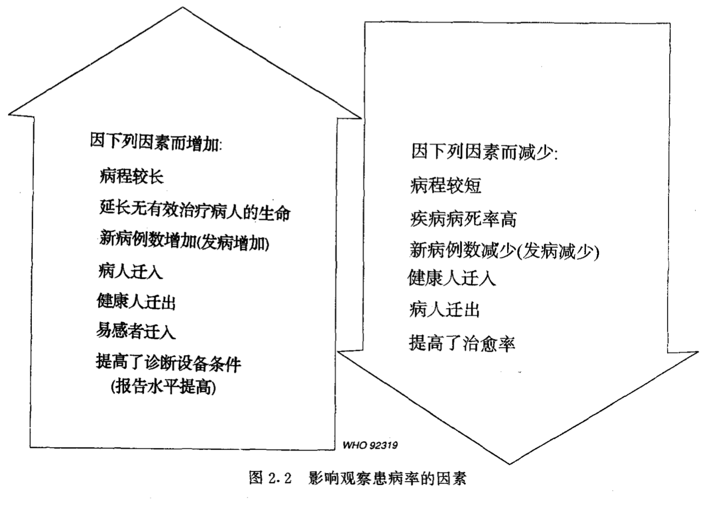

来源：[WHO：《基础流行病学》](https://apps.who.int/iris/bitstream/handle/10665/1624/7117023244_CHI.pdf?sequence=1&isAllowed=y)

## 基本概念

> <b>危险人群 Population at risk：</b>对疾病易感的那部分人被称之为危险人群
>
> <b>患病 Prevalence：</b>某特定人群在某特定时刻的患者人数
>
> <b>发病 Incidence：</b>某特定人群在某特定时期内的新病例数

患病与发病之间的关系在不同的病种之间是不同的：  
对于糖尿病来说，患病可以很高但发病则很低；而对感冒而言，则正相反，表现为患病低而发病高。

如果把患病和发病的数据转换成率则会成为更加有用的资料。  
率的计算是将病例数除以相应的危险人口数，用 n 个人中的病例数来表达。

> <b>患病率 Prevalence rate：</b>  
> P = 某时间内具有疾病或情况的人数 / 该时间内危险人群的人口数 * 10的 n 次方

有关危险人群的资料往往不能得到。  
在许多研究中，通常使用研究地区内的总人口作为近似的危险人群人口数。  
患病率常使用每1000人或100人中的病例数。

如果资料是在一个时点上收集的数据，P是“时点患病率”。有时使用"期间患病率"更为方便。  
计算可用某一特定时间内一直患病或任何一时点有病的总病例数，被同一时间区间内全部危险人群的人口数或中期人口数去除。

几种因素可影响患病率，特别是:
- 疾病的严重程度(如果患者中许多人死亡，则患病率是低的)
- 疾病的病程(如果疾病的病程短，则患病率比长病程的病要低) 
- 新病例数(如果许多人都产生某种疾病，则其患病率比只有少数人得病的疾病要高)

> <b>发病率 Incidence rate：</b>  
> I = 在该时间内所发生的新病例数（即发病人数） / 危险人群中每个人乘以观察时间的总和 * 10的n次方

严格来说分子仅指那些初次患病者，发病率的单位须始终包含时间（如天、月、年等）。  
计算发病率的分母是在定义的研究期间内所有被观察者无病时间单位的总和。

> <b>累积发病率 / 危险性 Cumulative incidence rate or risk</b>：  
> CI = 在特定时间内发病人数 / 在观察开始时危险人群中无病者人数 * 10的n次方

观察时间可长可短，但通常是几年或是终生。  
因此，累积发病率类似于"死亡危险性" (risk of death) 的概念，类似于保险统计或寿命表的计算。累积发病率因其简单通俗而适合于卫生决策者们的信息交流。

> <b>病死率 Case-fatality：</b>  
> 病死率 % = 特定时间内因某病死亡人数 / 同期内诊断的病例总数 * 100

<b>这几个指标的相互关系：</b>

- <b>患病率取决于发病率和病程。</b>当患病率是低的且不随时间而显著变动时，患病率可按下述公式做近似的计算：  
  P = 发病率 x 疾病的平均病程
- 累积发病率取决于发病率和观察时间长短。
- 由于发病率通常随年龄而变化，因而常常使用年龄专率。  
  假若发病率低且观察时间短时，累积发病率是发病率的一种很好的近似值。

> <b>死亡率 Mortality：</b>  
> 粗死亡率 = 特定时间内死亡人数 / 同期平均总人口数 * 10的n次方

死因编码：使用国际上统一的分类标准，对死因进行编码的方法可查阅`国际疾病分类（International classification of diseases）`。

粗死亡率的主要缺点表现在未考虑到年龄性别、种族、社会经济收入及其他一些因素对死亡机会的影响，具有上述不同特征人群的死亡率是不同的。  
因而粗死亡率不宜用于对不同时间或不同地区进行比较。

> <b>年龄和性别死亡专率 Sex-specific death rate：</b>  
> 某地某时间内特定年龄性别组人口中死亡总数 / 该地该时间同一年龄性别组估计总人口数 * 10的n次方
>
> <b>出生前及刚出生后的死亡率 Mortality before and just after birth</b>  
>
> 婴儿死亡率、儿童死亡率、产妇死亡率
>
> <b>标化率 Standardized rates：</b>  
> 年龄标化死亡率（也称年龄调整率）是总死亡率测量指标，其表示某人群按标准年龄构成时可能发生的死亡率

住院率除了受人群发病率的影响外，还受床位的可利用率、住院政策及社会因素等影响。

## 研究类型

> <b>观察性流行病学：</b>在疾病发生的自然过程中，研究者并不干预的情况下测量疾病，包括

- 描述性研究  
  只描述某一人群中某种疾病的发生情况，这常是流行病学调查的第一步
- 分析性研究  
  进一步分析健康状况与其他因素之间的关系
- 生态学研究  
  常可作为更详尽的流行病学研究工作的一个良好开端
- 横断面研究  
  常用于调查属于个体固有特征的暴露，如种族、社会经济状况、血型。在疾病的突然爆发时，涉及几种暴露测量的横断面研究，常是病因研究中的最简便的第一步
- 病例对照研究
- 队列研究 p.35  
  大型研究，需要长期随访，因为疾病在暴露后一段很长时间才可发生。例如，辐射致成白血病的诱导期（即某种特殊病因引起结果所需时间）为许多年，因此，对参加研究者相应地应随访较长时间

> <b>实验性流行病学：</b>涉及如何主动改变某种疾病的决定因素，如某种暴露或行为，或通过治疗改变某种疾病的进展，主要的实验研究设计是以病人为对象的随机化对照试验，包括：

- 随机化对照试验  
  进行试验的干预可以是一种新药或一种新的治疗方案
- 现场试验  
  通常试验对象是一般人群中的非住院者，研究目的是防止发生率较低的疾病的发生。曾实施的最大的现场试验之一是用 Salk 疫苗预防脊髓灰质炎的试验，涉及100多万儿童
- 社区试验  
  适用于有社会背景的疾病，其较易受个体行为和人群行为干预的影响。心血管疾病就是一个适于社区试验的例子

<b>流行病学研究中可能发生的误差</b>

> <b>随机误差：</b>  
> 从样本观察得到的值与总体真实值的差异，有三个主要来源：个体的生物学变异，抽样误差，以及测量误差。

实际上，样本含量大小常由后勤与财政考虑所决定，在样本大小与费用之间总需作出妥协。世卫组织己出版在健康研究中确定样本大小的实用指南。

> <b>系统误差：</b>  
> 有些研究变量特别难以测量，其中如性格、饮酒习惯、在迅速改变的环境条件中的既往暴露，这些困难均可导致系统误差。  
> 主要来源有选择偏倚，测量（分类）偏倚，混杂（p.43）。

在职业流行病学研究中，有一种十分重要的选择偏倚， 称为健康工人效应。工人的身体必须足够健康以承担工作。患有严重疾病和残疾者一般都被排除在就业之外。同样，如果仅根据体检结果所作的研究，而对因不舒服卧床在家或住院未归的病人未进行随访，可使结果偏倚。所有流行病学研究设计均须考虑这类偏倚。

<b>伦理问题</b>

流行病学家在任何时候必须尊重个人私隐，他们有义务告诉社区，正在做什么、以及为什么要做，并将研究结果及其意义传递给有关社区。所有进行流行病学研究的计划必须在工作开始前送交适当指定的伦理委员会机构。

## 统计学基础

如果分布基本近似正态 ，即呈对称的钟形 ，标准差尤为有用。许多生物学特性，如身高、体重、血压常被认为是<b>正态分布</b>的。在正态分布曲线下，约2 / 3的值落在均数的一个标准差范围内，约95%的值落在均数的二个标准差范围内。

<b>对数正态分布</b>在流行病学中也常用。虽然其是高度偏态的，但其值的对数是正态分布的。暴露于污染的个体血液中化学物的含量常呈对数正态分布。

总体和样本

置信区间

假设检验

I 型和 II 型错误

两个变量之间的关系

- 卡方检验
- 相关
- 回归：最常用的回归方程式是线性回归，它的数学模型是直线

## 流行病学和疾病预防

筛查是可以在大范围内通过快速检测手段将未被发现的疾病或缺陷检查出来的过程。筛查试验可以将那些明显健康的人与有病的人分开。

筛查的不同类型：

- 群体筛查是对全人群的筛查
- 复合或多相筛查是指为同样的目的使用各种不同的筛查试验
- 对有某种特殊暴露的人群的目的性筛查常在环境卫生和劳动卫生中使用，如对铅铸造厂工人的筛查
- 病例寻找或机会性筛查仅限于对那些由于其他目的来看病的病人

被筛查的疾病应该是如果不早期诊断就会有严重后果的疾病。在降低发病率和死亡率方面，筛查后进行的早期治疗应该比疾病明显进展后采取的治疗更有效。

筛查试验本身必须费用低、容易应用、能为公众接收、可靠而且真实。筛查方案的价值最终还要看它对发病、死亡和残疾所产生的效果。

## 传染病的流行病学

流行最初通常可以是点源的或接触传染的。

对于<b>点源流行</b>，易感个体或多或少同时暴露于一个传染源。这导致病例数的快速增长，并常常是在几个小时之内，在第一章中描述的霍乱流行就是一个点源流行的例子。

在<b>接触传染性流行</b>中，疾病是从一个人到一个人的传播，并且病例数最初的增长是较慢的。

<b>传染病流行的调查和控制</b>

- 调查
- 管理和控制

## 临床流行病学

- 正常和异常的定义
- 诊断试验的准确性
- 疾病的自然史和预后
- 治疗的效果以及临床实践中的预防

## 环境流行病学与职业流行病学

## 自学问题

批判性地研究：

- 文中被调查人群是哪些人？
- 包括哪些人，排除了哪些人？
- 研究对象是不是来自目标人群的样本？如果不是，为什么？
- 样本是怎样选出的？
- 是随机选择，还是系统选择，或志愿者自己选择？
- 选择中有什么可能的偏倚？
- 选择过程会对结果造成怎样的影响？
- 对所要回答的问题来说，样本是不是足够大？

对于实验有下列有关的问题：

- 如何将病人划分到不同的治疗组，是随机方式还是以其他方式？
- 应该包括怎样的对照组（安慰剂，不做治疗的对照，是两者都有还是都没有）？
- 治疗是怎样进行比较的？是否用客观的方法来测量结果或反应？
- 有无质量控制方法支持的化学分析或其它测量？

对于调查应考虑下列问题：

- 数据收集过程是否正确（包括问卷设计和预试验）？
- 怎样处理无应答或数据不完全的情况？
- 有无明显的偏倚来源？
- 有无质量控制方法支持性的化学分析或其他方法？
- 数据是如何表示的？
- 是否有足够清晰的图表？数字是否一致？是否利用了所有样本？
- 标准差是否与均值、置信区间、回归系数或其他统计量以及原始数据一起表示出来了？
- 对于样本的各种有关变量是否都做了描述？
- 有无充分证据说明不同的治疗组在接受治疗以前就在某些重要方面有共同点？

评估和解释结果

究竟强调哪些问题取决于考虑对象是实验性的还是调查性的，对于实验性的：

- 检验的假设是否用统计术语进行了明确的表达？
- 统计分析是否恰当？
- 统计分析是否详尽？（仅有P值是不够的，应有足够的数字证据表明总数，最好有可区间）
- 分析中是否包括了所有的研究对象？
- 统计、检验的步骤是否正确解释？
- 流行病学分析是否问答了要研究的问题？

对一项调查性的：

- 是否选择了适当的统计学方法，并作了适当估计？
- （如果合适）是否对所有数据集都进行了多变量分析？对丢失的观 察数据是如何处理的？
- 对结果的解释是否正确？是否忽略了某些变量间的交互关系？
- 流行病学分析是否回答了所要研究的问题？

在衡量证据时应注意下列问题：

- 所研究的问题是否值得首先提出来？各种可能答案的结果如何？研究是否为实践提出了建议？
- 作者在回答问题方面是否做出了足够的努力？
- 研究设计是否可以做出重大改进？
- 如果报告中缺乏某项信息，是否会妨碍对研究做出充分的评价？
- 作者是否描述了以前类似课题研究所得的结果？