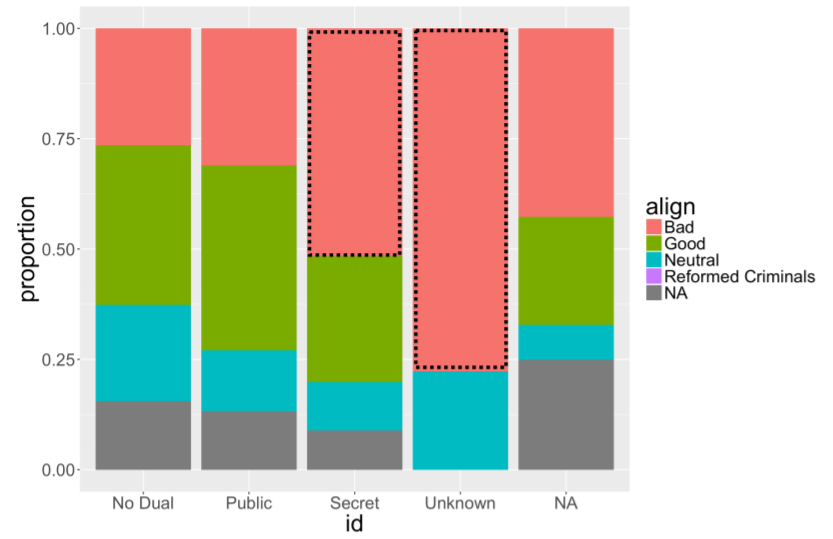

# Exploratory Data Analysis

## Exploring categorical data
一个变量有多少层级
``` 
> levels(comics$align)
[1] "Bad" "Good" "Neutral"
[4] "Reformed Criminals" 
```
*Note: NAs ignored by `levels()` function*

### Counts vs Proportions

Counts:
```
> tab_cnt <- table(comics$id, comics$align)
> tab_cnt
 	Bad Good Neutral Reformed Criminals
 No Dual 474 647 390 0
 Public 2172 2930 965 1
 Secret 4493 2475 959 1
 Unknown 7 0 2 0
```

Conditional proportions:
```
# Condition on the rows (i.e. rows sum to 1)
> prop.table(tab_cnt, 1)

 	Bad Good Neutral
 No Dual 0.314 0.428 0.258
 Public 0.358 0.483 0.159
 Secret 0.567 0.312 0.121
 Unknown 0.778 0.000 0.222

# Condition on the columns (i.e. columns sum to 1)
> prop.table(tab_cnt, 2)

 	Bad Good Neutral
 No Dual 0.066331 0.106907 0.168394
 Public 0.303946 0.484137 0.416667
 Secret 0.628743 0.408956 0.414076
 Unknown 0.000980 0.000000 0.000864
```

Conditional bar charts:
```
# Plot proportion
ggplot(comics, aes(x = align, fill = gender)) + 
  geom_bar(position = "fill") +
  ylab("proportion")
```


## Distribution of one variable
Marginal distribution
```
tab_cnt <- table(comics$id, comics$align) 
```

Conditional distribution
```
# Faceting
ggplot(comics, aes(x = id)) +
	geom_bar() +
	facet_wrap(~align)

# Filtering

# Dotplot
ggplot(data, aes(x = weight)) + geom_dotplot(dotsize = 0.4)

# Histogram (with binwidth)
ggplot(data, aes(x = weight)) + geom_histogram(binwidth = 3)

# Density plot (with bandwidth)
ggplot(data, aes(x = weight)) + geom_density(bw = 5)

# Boxplot
ggplot(data, aes(x = 1, y = weight)) + geom_boxplot()
# Side-by-side boxplot
ggplot(common_cyl, aes(x = as.factor(ncyl), y = city_mpg)) + geom_boxplot() 

```

### Visualization in higher dimensions
Plots for 3 variables
```
ggplot(cars, aes(x = msrp)) +
 geom_density() +
 facet_grid(pickup ~ rear_wheel, labeller = label_both)
```


Higher dimension plots
- Shape
- Size
- Color
- Pattern
- Movement
- x-coordinate
- y-coordinate

## Measures of Center and Variablity
**Center**

- `mean()`
- `median()`
- `mode()`

groupwise
```
# group_by()
life %>%
	group_by(continent) %>%
	summarize(mean(expectancy),
	median(expectancy))
```

**Variablity**

- standard deviation:`sd()`
- variance:`var()`
- interquartile range:`IQR()`
- range:`diff(range())`
