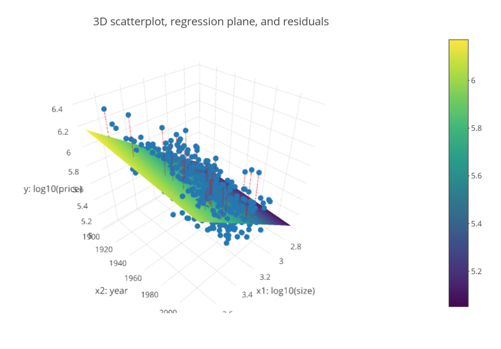

# Modeling with Data in the Tidyverse

## Introduction to Modeling
General modeling framework formula:  
$y = f(\overrightarrow{x}) + \epsilon$

- $y$: outcome variable of interest, the phenomenon you wish to model
- $\overrightarrow{x}$: explanatory/predictor variables used to inform your model
- $f()$: function of the relationship between $y$ and $x$ (*the signal*)
- $\epsilon$: unsystematic error component (*the noise*)

### The modeling problem for explanation
$y = f(\overrightarrow{x}) + \epsilon$

1. usually you won't know the true form of $f()$, nor the mechanism that generates the errors $\epsilon$

2. you will know the observations $y$ and $\overrightarrow{x}$, as they are given in our data

3. the goal is to construct or "fit" a model f-hat that approximates $\hat{f}()$ while ignoring $epsilon$

4. **goal restated**: separate the signal from the noise

5. then generate *fitted/predicted* values $\hat{y} = \hat{f}(\overrightarrow{x})$

*univariate*: only considering one variable at a time

*overplotting*: adding random jitter `geom_jitter()`

**Correlation coefficient**:  
`cor()`, a summary statistic between -1/1 measuring the strength of linear association of two numerical variables, or the degree to which points fall on a line


### The modeling problem for prediction
Key difference in modeling goals:

1. **Explanation:**  
We care about the form of $\hat{f}()$, in particular any values quantifying relationships between $y$ and $\overrightarrow{x}$

2. **Prediction:**  
We don't care so much about the form of $\hat{f}()$, only that it yields "good" predictions $\hat{y}$ of $y$ based on $\overrightarrow{x}$


## Modeling with Basic Regression
### Refresher: Modeling in general
**Truth:**

Assumed model is $y = f(\overrightarrow{x}) + \epsilon$

**Goal:**

Given $y$ and $overrightarrow{x}$, fit a model $\hat{f}(\overrightarrow{x})$ that approximates $f(\overrightarrow{x})$, where $\hat{y} = \hat{f}(\overrightarrow{x})$ is the *fitted/predicted* value for the observed value $y$

### Modeling with Basic Regression

**Truth:**

- Assume $f(x) = \beta_0 + \beta_1 \cdot x$
- *Observed* value $y = f(x) + \epsilon = \beta_0 + \beta_1 \cdot x + \epsilon$

**Fitted:**

- Assume $\hat{f}(x) = \hat{\beta}_0 + \hat{\beta}_1 \cdot x$
- *Fitted/predicted* value $\hat{y} = \hat{f}(x) = \hat{\beta}_0 + \hat{\beta}_1 \cdot x$

**Regression line**

```
# Add a "best-fitting" line
geom_smooth(method = "lm", se = FALSE)
```

Equation for fitted regression line: $\hat{y} = \hat{f}(\overrightarrow{x}) = \hat{\beta}_0 + \hat{\beta}_1 \cdot x$


**Computing slope and intercept of regression line**

Using the formula form y ~ x, which is akin to $\hat{y} = \hat{f}(\overrightarrow{x})$

```
# Fit regression model using formula of form: y ~ x
# y: outcome, x: explanatory variable

model <- lm(formula = score ~ age, data = evals)

# Output regression table using wrapper function
get_regression_table(model)
```
### Predicted value
- Predictive regression models in general:  
$\hat{y} = \hat{f}(x) = \hat{\beta}_0 + \hat{\beta}_1 \cdot x$

- Our predictive model: $sc\hat{o}re = 4.46 - 0.006 \cdot age$
- Our prediction: 4.46 - 0.006 x 40 = 4.22

### Prediction error
**Residuals as model errors**

- Residual = $y - \hat{y}$
- Corresponds to $\epsilon$ from $y = f(\overrightarrow{x}) + \epsilon$
- For our example instructor: $y - \hat{y} = 3.5 - 4.22 = -0.72$
- With linear regression, sometimes you'll obtain positive residuals and other times negative.  
In linear regression, they are on average 0.

**Computing all predicted values**

```
# Get information on each point

model <- lm(formula = score ~ age, data = evals)
get_regression_points(model)

# A tibble: 463 x 5      
      ID  score age   score_hat residual
<int> <dbl> <dbl>     <dbl>    <dbl> 
1     1   4.7    36      4.25    0.452
2     2   4.1    36      4.25   -0.148
3     3   3.9    36      4.25   -0.348
4     4   4.8    36      4.25    0.552
5     5   4.6    59      4.11    0.488
6     6   4.3    59      4.11    0.188
7     7   2.8    59      4.11   -1.31
8     8   4.1    51      4.16   -0.059
9     9   3.4    51      4.16   -0.759
10    10  4.5    40      4.22    0.276
# ... with 453 more rows
```

### Fitting a regression with a categorical x
return group means of different categories of x

```
# Fit regression model
model_score_3 <- lm(score ~ gender, data = evals)

# Get regression table
get_regression_table(model_score_3)

# A tibble: 2 x 7
term       estimate std_error statistic p_value lower_ci upper_ci  <chr>         <dbl>     <dbl>     <dbl>   <dbl>    <dbl>    <dbl>
1 intercept     4.09      0.039    106.     0        4.02     4.17
2 gendermale    0.142     0.051      2.78   0.006    0.042    0.241

# Compute group means based on gender
evals %>%   
group_by(gender) %>%   
summarize(avg_score = mean(score), sd_score = sd(score))

# A tibble: 2 x 2
gender avg_score    sd_score
<fct>      <dbl>    <dbl>
1 female      4.09    0.564
2 male        4.23    0.522

# Get information on each point
get_regression_points(model_score_3)

```

## Modeling with Multiple Regression
### Combining numerical variables
Fit regression model using formula of form: y ~ x1 + x2

```
# y tilde x1 PLUS x2, where the plus indicates you are using more than one explanatory variable
model_price_1 <- lm(log10_price ~ log10_size + yr_built, data = house_prices)

# Output regression table
get_regression_table(model_price_1)
```

**Best fit and residuals**

```
# Computing all predicted values and residuals
get_regression_points(model_price_1)

# Square all residuals and sum them
get_regression_point(model_price_1) %>%
  mutate(sq_residuals = residuals^2) %>%
  summarize(sum_sq_residuals = sum(sq_residuals))
```



Just as with "best-fitting" regression lines, of all possible planes, the regression plane minimizes the sum of squared residuals. This is what is meant by "best fitting" plane.

### Combining numerical and categorical variables
Recall the notion of a "baseline for comparison" level when using a categorical variable in a regression model.

```
model_price_3 <- lm(log10_price ~ log10_size + condition, data = house_prices)

get_regression_table(model_price_3)

# A tibble: 6 x 7
term  estimate  std_error statist
```

house price for condition3:  
$\hat{y} = 2.88 +0.032 + 0.837 \cdot 2.90 = 5.34$

importing new data frame:  
`get_regression_points(model_price_3, newdata = new_houses)`


## Model Assessment and Selection
### Assessing with sum of squared residuals

```
get_regression_point(model_price_1) %>%
  mutate(sq_residuals = residuals^2) %>%
  summarize(sum_sq_residuals = sum(sq_residuals))
```

### Assessing with R-squared

R-squared is another numerical summary of how well a model fits points.

**Variance 方差**: another measure of variability/spread, $sd ^ 2$

**R-squared**  
1 minus the variance of the residuals over the variance of the outcome variable:  
$R^2 = 1 - \dfrac{Var(residuals)}{Var(y)}$


- Since $Var(y) \geqslant Var(residuals)$, so $R^2$ is between 0 & 1
- Smaller $R^2$ ~ "poorer fit"
- $R^2 = 1$ ~ "perfect fit" and $R^2 = 0$ ~ "no fit"


$R^2$ is the proportion of the total variation in the outcome variable $y$ that the model explains.

```
get_regression_points(model_price_1) %>%
  summarize(r_squared = 1 - var(residual) / var(log10_price))
```

### Assessing predictions with RMSE
Root mean square error 均方根误差:

```
# Mean squared error
get_regression_point(model_price_1) %>%
  mutate(sq_residuals = residuals^2) %>%
  summarize(mse = mean(sq_residuals))
  
# Root mean squared error 最后一步开根号
get_regression_point(model_price_1) %>%
  mutate(sq_residuals = residuals^2) %>%
  summarize(mse = mean(sq_residuals)) %>%
  mutate(rmse = sqrt(mse))
```

RMSE can be thought of as the "typical" error a predictive model will make.

### "Validation set" prediction framework
This forms the backbone of a well-known machine learning method for model assessment called cross-validation.

**Validation set approach**

Use two independent dataset to:

1. Train/fit your model on one set of data
2. Evaluate your model's predictive power, i.e., validate your model's performance on a different set of data

**Training/test set split in R**

```
# Randomly shuffle order of rows:
house_price_shuffled <- house_prices %>%
  sample_frac(size = 1, replace = FALSE)

# Split into train and test:
train <- house_price_shuffled %>%
  slice(1:10000)
test <- house_price_shuffled %>%
  slice(10001:21613) %>%

# Train model on train:
train_model_price_1 <- lm(log10_price ~ log10_size + yr_built, data = train)

# Get predictions on test:
get_regression_points(train_model_price_1, newdata = test)

# Assessing and comparing RMSE
```

## Where to go from here?
- R source code for all videos  
Available at http://bit.ly/modeling_tidyverse

- DataCamp courses using other models  
Courses with different $f()$ in $y=f(\overrightarrow{x})+ε$:
  - [Machine Learning with Tree-Based Models in R](https://learn.datacamp.com/courses/machine-learning-with-tree-based-models-in-r)
  - [Supervised Learning in R: Case Studies](https://learn.datacamp.com/courses/supervised-learning-in-r-case-studies)


- ModernDive: [Online textbook](https://moderndive.com/)
  - Uses `tidyverse` tools: `ggplot2` and `dplyr`
  - Expands on the regression models from this course
  - Uses `evals` and `house_prices` datasets (and more)
  - Goal: Statistical inference via data science

- More to explore:
  - Parallel slopes model
  - Polynomial model
  - Tree models
