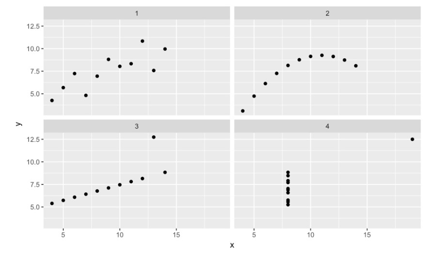

# Correlation and Regression in R

## Visualizing two variables
### Bivariate relationships

- Both variables are numerical

- Response variable
  - y, dependent

- Explanatory variable
  - something you think might be related to the response
  - x, independent, predictor

### Graphical representations
- Put response on vertical axis
- Put explanatory on horizontal axis

- **Scatterplots** are the most common and effective tools for visualizing the relationship between two numeric variables
- You can think of **boxplots** as scatterplots for which the variable on the x-axis has been discretized.


Boxplot `aes(x = cut(data-for-x-axis, breaks = 5))`

Any patterns and deviations from those patterns, we see in these plots could give us some insight into the nature of the underlying phenomenon.

### Characterizing bivariate relationships

We look for four things: form, direction, strength, and outliers.

- **Form** (e.g. linear, quadratic, non-linear)  
the overall shape made by the points

- **Direction** (e.g. positive, negative)  
whether the two variables tend to move in the same direction

- **Strength** (how much scatter/noise?)  
  - Do the points seem to be clustered together in a way that suggests a close relationship?
  - Or are they very loosely organized?

- **Outliers**  
These outliers may be erroneous measurements, or they can be exceptions that help clarify the general trend.


```
# Scatterplot with scale_x_log10() and scale_y_log10()
ggplot(data = mammals, aes(x = BodyWt, y = BrainWt)) +
    geom_point() +
    scale_x_log10(BodyWt) + 
    scale_y_log10(BrainWt)

# Scatterplot with coord_trans()
ggplot(data = mammals, aes(x = BodyWt, y = BrainWt)) +
  geom_point() + 
  coord_trans(x = "log10", y = "log10")
```


## Correlation
Quantifying the strength of bivariate relationships

- Correlation coefficient between -1 and 1  
captures the strength of the linear relationship between two variables

- Sign -> direction positive or negative

- Magnitude -> strength

*It's common to encounter variables that are strongly-related, but in a nonlinear way.*


### Pearson product-moment correlation
Correlation is most often denoted with the letter r and it is a function of two variables, most commonly x and y.

$r(x,y) = \dfrac{Cov(x,y)}{\sqrt{SXX \cdot SYY}}$

`*denominator 分母 numerator 分子*`

$r(x,y) = \dfrac{\sum_{i=1}^{n}(x_i - \bar{x})(y_i - \bar{y})}{\sqrt{\sum_{i=1}^{n}(x_i-\bar{x})^2 \cdot \sum_{i=1}^n(y_i-\bar{y})^2}}$


**cor()**

The `cor(x, y)` function will compute the Pearson product-moment correlation between variables. At the same time, the `cor()` function is very conservative when it encounters missing data (e.g. `NA`s). 

The `use` argument allows you to override the default behavior of returning `NA` whenever any of the values encountered is `NA`. Setting the `use` argument to `"pairwise.complete.obs"` allows `cor()` to compute the correlation coefficient for those observations where the values of `x` and `y` are both not missing.

```
# Compute correlation for all non-missing pairs

ncbirths %>%
  summarize(N = n(), r = cor(weight, weeks, use = "pairwise.complete.obs"))
```

### *Francis Anscombe* dataset
In 1973, Francis Anscombe famously created four datasets with remarkably similar numerical properties, but obviously different graphic relationships. 

```
ggplot(data = Anscombe, aes(x = x, y = y)) +
  geom_point() +
  facet_wrap(~ set)
```




These datasets have the same number of points, the same mean and standard deviation in both x and y, the same correlation, and the same regression line.

### Spurious correlations
Remarkable but nonsensical correlations are called "spurious."

Statisticians must always be skeptical of potentially spurious correlations. Human beings are very good at seeing patterns in data, sometimes when the patterns themselves are actually just random noise.

- `time`: Any time you see two variables linked over time, you should be skeptical of the role that time can play as a confounder.

- `space`: Space can also be present in spurious correlations.  
Colored maps, or choropleths, can be visually arresting ways of conveying information, but they can also reveal spurious correlations.

- In other cases, it may not be so obvious what confounding variables are driving the spurious correlation.

## Simple linear regression
### Visualization of linear models
**The "best" fit line**

The simple linear regression model for a numeric response as a function of a numeric explanatory variable can be visualized on the corresponding scatterplot by a straight line. This is a "best fit" line that cuts through the data in a way that minimizes the distance between the line and the data points.

The `geom_smooth()` function allows you to draw such models over a scatterplot of the data itself. This technique is known as visualizing the model in the *data space*. 

The `method` argument to `geom_smooth()` allows you to specify what class of smooth model you want to see. Note that `geom_smooth()` also takes an `se` argument that controls the standard error, which we will ignore for now.

```
# method argument set to "lm," which stands for linear model
# se argument set to "FALSE" or 0, to turn off gray shading (for the standard error associated with the line)

ggplot(data = possum, aes(x = tailL, y = totalL)) +
  geom_point() + geom_smooth(method = "lm", se = FALSE)
```

### Understanding linear models
**Generic statistical model:**  
response = f(explanatory) + noise

**Generic linear model:**  
response = intercept + (slope * explanatory) + noise  

**Regression model:**  
$Y = \beta_0 + \beta_1 \cdot X + \epsilon$

1. $\epsilon \sim N(0, \sigma_\epsilon)$  
Understanding the specification of the noise term is crucial to thinking like a statistician. In a regression model, we specify that the distribution of the noise is normal, with mean 0 and a fixed standard deviation.

2. The part of the function aside from the noise term consists of a linear function that produces the fitted values.  
These are usually denoted with *Y hat* (expected values of the response based on the model):  
$\hat{Y} = \hat{\beta}_0 + \hat{\beta_1} \cdot X$

3. The residuals are the realization of the noise term:  
*Residuals*: $e = Y - \hat{Y}$

4. $\epsilon$ and $e$ play analogous roles in the regression equation
  1. $\epsilon$ is an unknown, true quantity
  2. while $e$ is a known, estimate of that quantity

**Fitting procedure**

- Given $n$ observations of pars ($x_i, y_i$)...
- Find $\hat{\beta}_0, \hat{\beta}_1$ that minimize $\sum_{i=1}^{n}e_i^2$

*Least squares* procedure is a well-understood, relatively simple, deterministic process that can be computed efficiently. It will always return a unique solution, except in rare, unrealistic cases.

- Easy, deterministic, unique solution
- Residuals sum to zero
- Line must pass through $(\bar{x},\bar{y})$ (denoting the average of x and y, respectively).
- The regression slope and the correlation coefficient are closely related, proportional to one another.
- Other criteria exist - just not in this course

**Key concepts**

- Y-hat is expected value given the corresponding value of X, it is our best guess for the true value of $y$ given that we know about $x$

- Beta-hats are estimates of true, unknown betas

- Residuals (e's) are estimates of true, unknown epsilons

- "Error" may be misleading term: better, noise

*Note:*

Recall $Y = b_0 + b_1 \cdot X$, 

  - the slope can be defined as: $b_1 = r_{X,Y} \cdot \frac{S_Y}{S_X}$  
  where $r_{X,Y}$ represents the correlation (`cor()`) of $X$ and $Y$ and $s_X$ and $s_Y$ represent the standard deviation (`sd()`) of $X$ and $Y$, respectively.

  - Second, the point $(\bar{x},\bar{y})$ is always on the least squares regression line, where $\bar{x}$ and $\bar{y}$ denote the average of $x$ and $y$, respectively.

### Regression vs. Regression to the mean
- Regression: techniques for modeling a quantitative response
- Types of regression models
  - Least squares
  - Weighted
  - Generalized
  - Nonparametric
  - Ridge
  - Bayesian
  
Galton's **"regression to the mean"** 均值回归:  
Regression to the mean is a concept attributed to Sir Francis Galton. The basic idea is that extreme random observations will tend to be less extreme upon a second trial.

> "Regression to the mean is so powerful that once-in-a-generation talent basically never sires once-in-a-generation talent. It explains why Michael Jordan’s sons were middling college basketball players and Jakob Dylan wrote two good songs. It is why there are no American parent-child pairs among Hall of Fame players in any major professional sports league."

## Interpreting regression models
When interpreting slope coefficients, one must pay careful attention to units and scales. Note that the units of the slope coefficient is the units of the response variable per unit of the explanatory variable.

### The `lm` summary output
An `lm` object contains a host of information about the regression model that you fit. There are various ways of extracting different pieces of information.

The `coef()` function displays only the values of the coefficients.   
Conversely, the `summary()` function displays not only that information, but a bunch of other information, including the associated standard error and p-value for each coefficient, the $R^2$, adjusted $R^2$, and the residual standard error. 

The summary of an `lm` object in R is very similar to the output you would see in other statistical computing environments (e.g. Stata, SPSS, etc.)

```
# mod is an object of type "lm", it's not a data frame, a function, a matrix or a list.
mod <- lm(uclaNew ~ amazNew, data = textbooks)
class(mod)

mod

# Show the coefficients
coef(mod)

# Show the full output
summary(mod)
```

### Fitted values and residuals
Once you have fit a regression model, you are often interested in the fitted values ($\hat{y}_i$) and the residuals ($e_i$), where $i$ indexes the observations. Recall that:  
$e_i = y_i− \hat{y}_i$

The least squares fitting procedure guarantees that the mean of the residuals is zero (n.b., numerical instability may result in the computed values not being *exactly* zero). At the same time, the mean of the fitted values must equal the mean of the response variable.

```
# Accessing the fitted values and residuals
fitted.values(mod)
residuals(mod)
```

### Tidying your linear model
As you fit a regression model, there are some quantities (e.g. $R^2$) that apply to the model as a whole, while others apply to each observation (e.g. $\hat{y}_i$). If there are several of these per-observation quantities, it is sometimes convenient to attach them to the original data as new variables.

The `augment()` function from the `broom` package does exactly this. It takes a model object as an argument and returns a data frame that contains the data on which the model was fit, along with several quantities specific to the regression model, including the fitted values, residuals, leverage scores, and standardized residuals.

```
library(broom)
augment(mod)

    uclaNew amazNew .fitted .se.fit .resid   .hat     .sigma .cooksd
1    27.67   27.95   34.44   1.460  -6.77105 0.01944 10.515 4.227e-03
2    40.59   31.14   38.27   1.418   2.32413 0.01834 10.543 4.687e-04
3    31.68   32.00   39.30   1.407  -7.61701 0.01806 10.507 4.955e-03
4    16.00   11.52   14.74   1.721   1.25854 0.02700 10.546 2.059e-04
```

### Making predictions
The `fitted.values()` function or the `augment()`-ed data frame provides us with the fitted values for the observations that were in the original data. However, once we have fit the model, we may want to compute expected values for observations that were *not* present in the data on which the model was fit. These types of predictions are called **out-of-sample**.

`predict(lm, newdata)` will give fitted values of any new datat

**Adding a regression line to a plot manually**

There may still be times when we will want to add regression lines to our scatterplot manually. To do this, we will use the `geom_abline()` function, which takes `slope` and `intercept` arguments.

## Model fit
How far off the model is for a typical case? Recall that some of the residuals are positive, while others are negative. In fact, it is guaranteed by the least squares fitting procedure that the mean of the residuals is zero. 

Thus, it makes more sense to compute the square root of the mean squared residual or root mean squared error (*RMSE*). R calls this quantity the *residual standard error*.

- SSE: Sums of squared errors
  - meaning: a single number that captures how much our model missed by
  - fallback: hard to interpret, since the units have been squared

```
mod_possum <- lm(totalL ~ tailL, data = possum)

mod_possum %>% 
  augment() %>%
  summarize(
    SSE = sum(.resid^2),
    SSE_also = (n() - 1) * var(.resid))
```

- RMSE: Root mean squared error
  - divide the sum of the squared residualsv(SSE) by the degrees of freedom (d.f.) in the model  
  $RMSE = \sqrt{ \frac{\sum_i{e_i^2}}{d.f.} } = \sqrt{ \frac{SSE}{d.f.} }$
  - meaning: the standard deviation of the residuals

```
library(broom)
mod_possum <- lm(totalL ~ tailL, data = possum

summary(mod_possum)

# Recover the residuals from mod
residuals(mod_possum)

# Compute RMSE
sqrt(sum(residuals(mod)^2) / df.residual(mod))
```

### Comparing model fits
What would be nice is if we had a way to compare the quality of the fit that was unitless. To do so, it is helpful to think about a benchmark.

**Null (average) model**:  
for all observations...$\hat{y}_{null} = \bar{y}$

Since we can always fit the null model, it serves as a baseline against which all other models will be compared.

```
# SST: SSE for the null model, the total sum of the squares
# SST that is not explained by our model is the SSE

mod_null <- lm(totalL ~ 1, data = possum)

mod_null %>% 
  augment(possum) %>%
  summarize(SST = sum(.resid^2))

# SSE, our model
mod_possum <- lm(totalL ~ tailL, data = possum)

mod_possum %>% 
  augment() %>%
  summarize(SSE = sum(.resid^2))
```

**Coefficient of determination (R squared)**

$R^2 = 1 - \frac{SSE}{SST} = 1 - \frac{Var(e)}{Var(y)}$

where $e$ is the vector of residuals and y is the response variable.

This gives us the interpretation of $R^2$ as the percentage of the variability in the response that is explained by the model, since the residuals are the part of that variability that remains unexplained by the model.

It is the most commonly cited measure of the quality of the fit of a regression model.

```
# Compute R-squared
bdims_tidy %>%
  summarize(var_y = var(wgt), var_e = var(.resid)) %>%
  mutate(R_squared = 1 - var_e/var_y)
```


**Connection to correlation**

- For least squared regression models with a single explanatory variable...  

$r^2_{x,y} = R^2$

#### Summary
*Correlation* is strictly a bivariate quantity, it can only be between a single response and a single explanatory variable. However, *regression* is a much more flexible modeling framework.

A model with a low R squared doesn't mean that you have a lousy model, but can still provide statistically significant insight into a complex problem. A model with a high R squared may be overfit or it may violate the conditions for inference.

> Essentially, all models are wrong, but some are useful.
> -- George Box

#### Unusual points
leverage and influence

**Leverage**

$h_i = \frac{1}{n} + $

The *leverage* of an observation in a regression model is defined entirely in terms of the distance of that observation from the mean of the explanatory variable. 

That is, observations close to the mean of the explanatory variable have low leverage, while observations far from the mean of the explanatory variable have high leverage. The y coordinate doesn't matter at all. **Points of high leverage may or may not be influential.**

The `augment()` function from the `broom` package will add the leverage scores (`.hat`) to a model data frame.

```
# Rank points of high leverage
mod %>%
  augment() %>%
  arrange(desc(.hat)) %>%
  head()
```

**Influence via Cook's distance**

As noted previously, observations of high leverage may or may not be influential. The influence of an observation depends not only on its leverage, **but also on the magnitude of its residual**. Recall that while leverage only takes into account the explanatory variable ($x$), the residual depends on the response variable ($y$) and the fitted value ($\hat{y}$ ).

Influential points are likely to have high leverage and deviate from the general relationship between the two variables. We measure influence using *Cook's distance*, which incorporates both the leverage and residual of each observation.

```
# Rank influential points
mod %>%
  augment() %>%
  arrange(desc(.cooksd)) %>%
  head(6)
```

**Removing outliers**

Observations can be outliers for a number of different reasons. Statisticians must always be careful—and more importantly, transparent—when dealing with outliers.

Sometimes, a better model fit can be achieved by simply removing outliers and re-fitting the model. However, one must have strong justification for doing this. A desire to have a higher $R^2$ is not a good enough reason!

- What is the justification? Not a valid data point?
- How does the scope of inference change?


