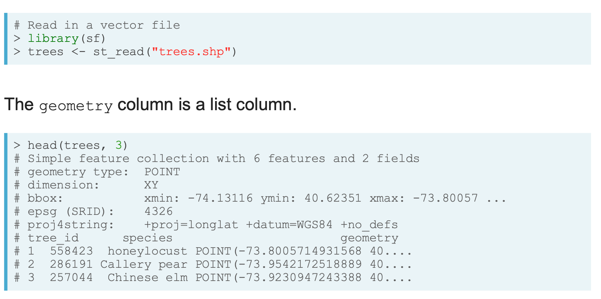
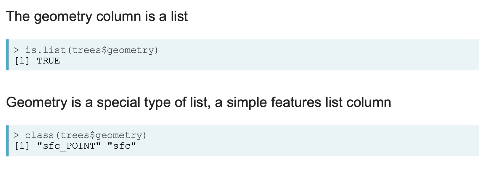
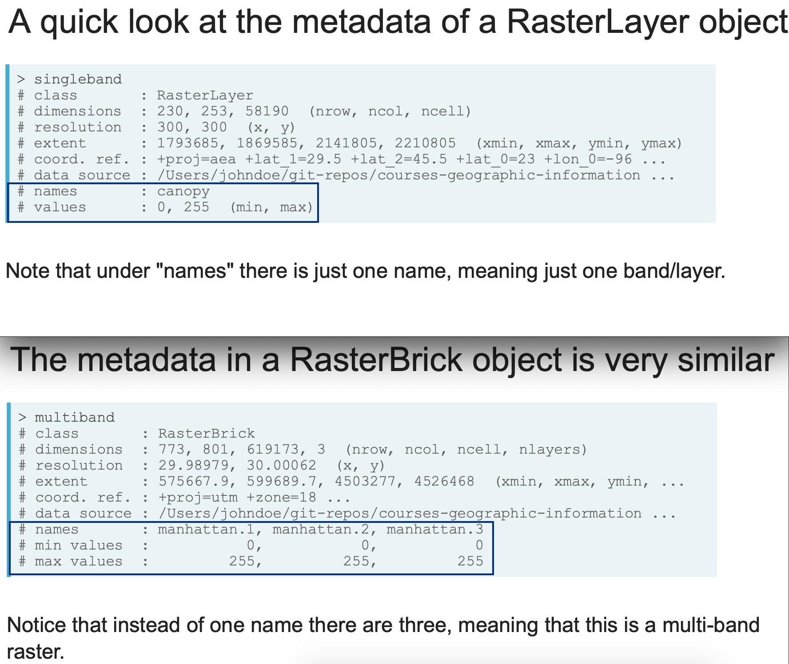
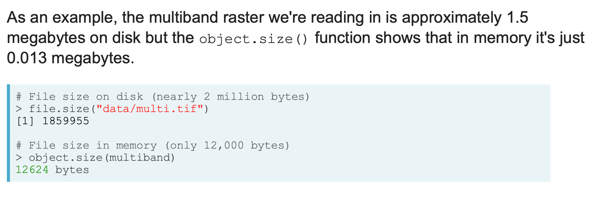

# Spatial Analysis with `sf` and `raster` in R

## Reading spatial data
### Vector
Read in vector data with `sf` package and `st_read()`

- formats: Shapefiles, GeoJson, GPS, netCDF
- wirte vector data: `st_write()`

Vector spatial objects are data frames, while `sf` data frames have special properties:

- They include spatial metadata like the coordinate reference system
- The geometry is stored in a list column
  - the list column allows you to store far more information in a single variable
  - use `as_tibble()` to convert data frame to a tibble and print friendly





#### Extracting geometric information from vector layers
The functions `st_area()` and `st_length()` return the area and length of features.

But the result is a `units` object that requires a little additional processing, which means the vector result is accompanied by metadata describing the object's units. 

Therefore, code like this won't quite work:

```
# This will not work
result <- st_area(parks)
result > 30000
```

Instead you need to either remove the units with `unclass()`, or you need to convert `val`'s class to `units`, for example:

```
# This will work
val <- 30000
unclass(result) > val

# This will work
units(val) <- units(result)
result > val
```

#### Plotting vectors
The `plot()` function, when applied to `sf` objects, will create a set of maps, one for each attribute in your data. Instead, if you want to create a map of a single attribute you can extract that attribute using, as an example, `plot(data["variable"])`.

Frequently you just want to plot the raw geometry with no attribute color-coding, for this, you can use the `st_geometry()` function to extract the geometry and plot the result.

```
parks <- st_read("parks.shp")
areas <- st_area(parks)

# Filter to parks greater than 30000 (square meters)
big_parks <- parks %>% 
  filter(unclass(areas) > 30000)

# Plot just the geometry of big_parks
plot(st_geometry(big_parks))
```


### Raster
Read in raster data with `raster` package

- formats: GeoTIFF, Esri grids, ENVI grids, ERDAS grids
- read single-band rasters: `raster()`
- read multi-band rasters: `brick()`

Once you read in raster data, they'll be stored as objects with the class RasterLayer or RasterBrick.

```
canopy <- raster("canopy.tif")
manhattan <- brick("manhattan.tif")

# Get the class for the new objects
class(canopy)
[1] "RasterLayer"
attr(,"package")
[1] "raster"

class(manhattan)
[1] "RasterBrick"
attr(,"package")
[1] "raster"

# Identify how many layers each object has
nlayers(canopy)
[1] 1
nlayers(manhattan)
[1] 3
```


#### Note when importing rasters...
Raster data can be very big depending on the extent and resolution (grid size). In order to deal with this, the `raster()` and `brick()` functions are designed to only read in the actual raster values as needed.

Therefore, `raster()` and `brick()` do not read in raster values by default. To conserve memory, raster values are imported only when required.



If you use the `head()` function, the raster package will read in only the values needed, not the full set of values.

The raster values will be read in by default if you perform spatial analysis operations that require it, or you can read in the values from a raster manually with the function `getValues()`.

- Use `inMemory()` to tell if the raster values have been read into R. It will return FALSE if the values are not in memory

- Read the values with the `getValues()` function


#### Other functions
Instead of storing raster objects in data frames, the raster package stores spatial data in specially designed R classes that contain slots where the data and metadata are stored. The data and metadata can be accessed using a suite of functions. 

- `extent()` to get the minimum and maximum X and Y coordinates of the raster
- `ncell()` and `nlayers()` to get the total number of grid cells or layers, respectively
- `crs()` to get the coordinate reference system
- `writeRaster()` to write raster data

#### Creating quick maps of your rasters with `plot()` and `plotRGB()`
- use `plot()` for single-band rasters or to look at the individual layers in a multi-band raster
- use `plotRGB()` to create a **true color** map of a multi-layered object


## Corrdinate reference system (CRS)
Vector and raster spatial data was created based on a specific CRS. Usually the spatial file has metadata defining the CRS, but sometimes there is not.

**Projected vs unprojected CRS**

- An unprojected CRS uses latitude and longitude coordinates and references the earth as a three-dimensional object
- A projected CRS uses X and Y coordinates as a two-dimensional representation of the earth

**Print out the CRS**

- `sf` package: `st_crs()` prints out a vector object's CRS
- `raster` package: `crs()` prints out a raster object's CRS

```
shape1 <- st_read("shape1.shp")
st_crs(shape1)
$epsg
[1] 4326

$proj4string
[1] "+proj=longlat +ellps=WGS84 +no_defs"

attr(,"class")
[1] "crs"
```

### Define CRS with EPSG or proj4string**

- You can use either an EPSG or proj4string to define the CRS. A CRS might have both but might only need one
- The EPSG code is a numeric representation of a CRS (e.g, 4326)
- The proj4string is a full set of parameters spelled out in a string (e.g.,
"+proj=longlat +ellps=WGS84 +no_defs")

**With `st_crs()`**

- Define with the proj4string  
`st_crs(shape2) <- "+proj=longlat +ellps=WGS84 +no_defs"`

- Define with the EPSG code  
`st_crs(shape2) <- 4236`


**For a raster define with crs()**  
`crs(multiband) <- "+proj=utm +zone=18+datum=WGS84 +units=m +no_defs+ellps=WGS84 +towgs84=0,0,0"`

Change the CRS with `st_transform()` or `projectRaster()`
- Use `st_transform()` to change the CRS for vectors
- Use `projectRaster()` to change the CRS for rasters


