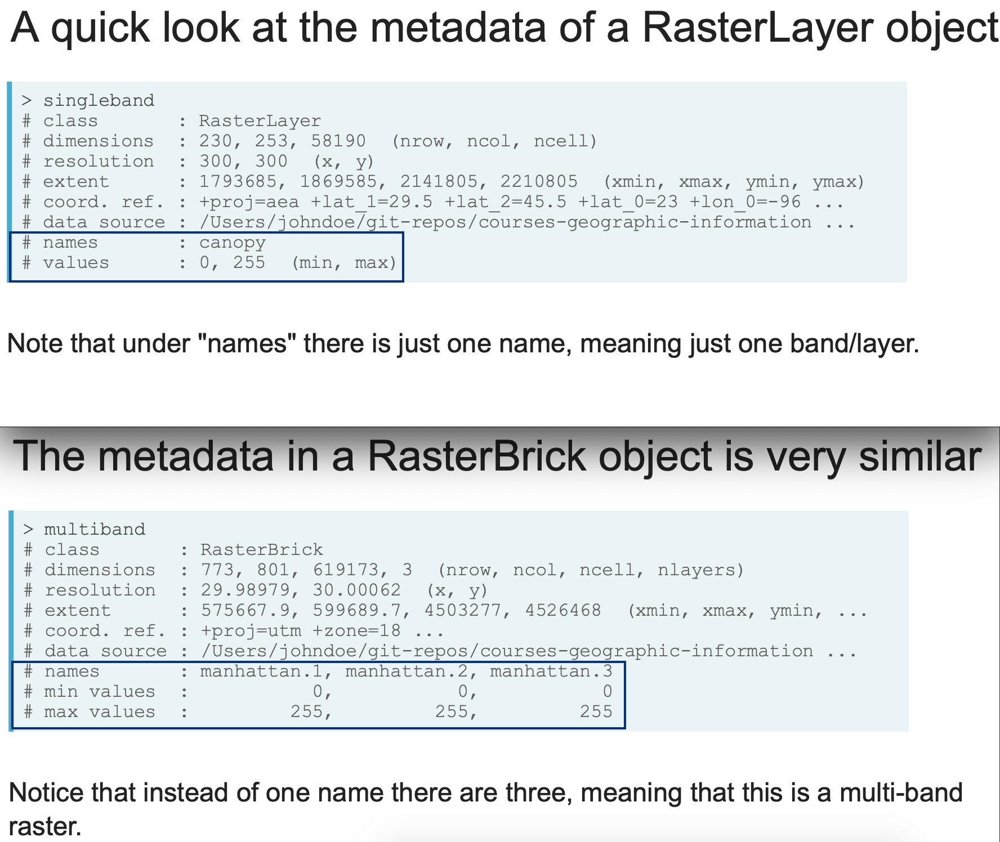

# Spatial Analysis with `sf` and `raster` in R

## Reading spatial data
### Vector
Read in vector data with `sf` package and `st_read()`

- formats: Shapefiles, GeoJson, GPS, netCDF
- wirte vector data: `st_write()`

Vector spatial objects are data frames, while `sf` data frames have special properties:

- They include spatial metadata like the coordinate reference system
- The geometry is stored in a list column
  - the list column allows you to store far more information in a single variable
  - use `as_tibble()` to convert data frame to a tibble and print friendly


#### Extracting geometric information from vector layers
The functions `st_area()` and `st_length()` return the area and length of features.

But the result is a `units` object that requires a little additional processing, which means the vector result is accompanied by metadata describing the object's units. 

Therefore, code like this won't quite work:

```
# This will not work
result <- st_area(parks)
result > 30000
```

Instead you need to either remove the units with `unclass()`, or you need to convert `val`'s class to `units`, for example:

```
# This will work
val <- 30000
unclass(result) > val

# This will work
units(val) <- units(result)
result > val
```

#### Plotting vectors
The `plot()` function, when applied to `sf` objects, will create a set of maps, one for each attribute in your data. Instead, if you want to create a map of a single attribute you can extract that attribute using, as an example, `plot(data["variable"])`.

Frequently you just want to plot the raw geometry with no attribute color-coding, for this, you can use the `st_geometry()` function to extract the geometry and plot the result.

```
parks <- st_read("parks.shp")
areas <- st_area(parks)

# Filter to parks greater than 30000 (square meters)
big_parks <- parks %>% 
  filter(unclass(areas) > 30000)

# Plot just the geometry of big_parks
plot(st_geometry(big_parks))
```


### Raster
Read in raster data with `raster` package

- formats: GeoTIFF, Esri grids, ENVI grids, ERDAS grids
- read single-band rasters: `raster()`
- read multi-band rasters: `brick()`
- write raster data: `writeRaster()`

```
# Read in the tree canopy single-band raster
canopy <- raster("canopy.tif")
# Read in the manhattan Landsat image multi-band raster
manhattan <- brick("manhattan.tif")
```
Once you read in raster data, they'll be stored as objects with the class RasterLayer or RasterBrick.

```
# Get the class for the new objects
class(canopy)
[1] "RasterLayer"
attr(,"package")
[1] "raster"

class(manhattan)
[1] "RasterBrick"
attr(,"package")
[1] "raster"

# Identify how many layers each object has
nlayers(canopy)
[1] 1
nlayers(manhattan)
[1] 3
```



