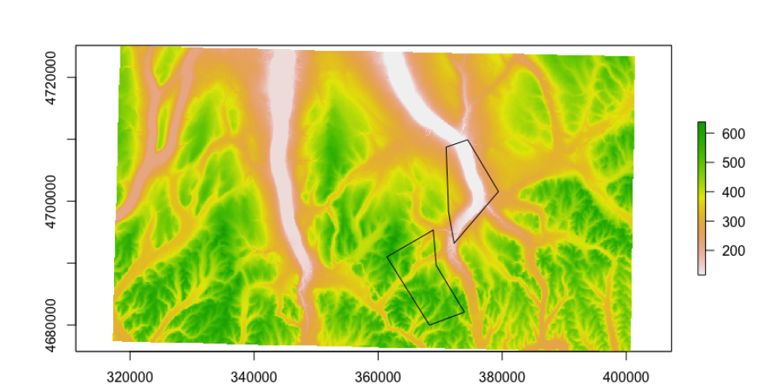
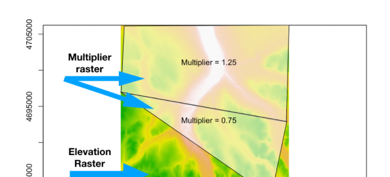
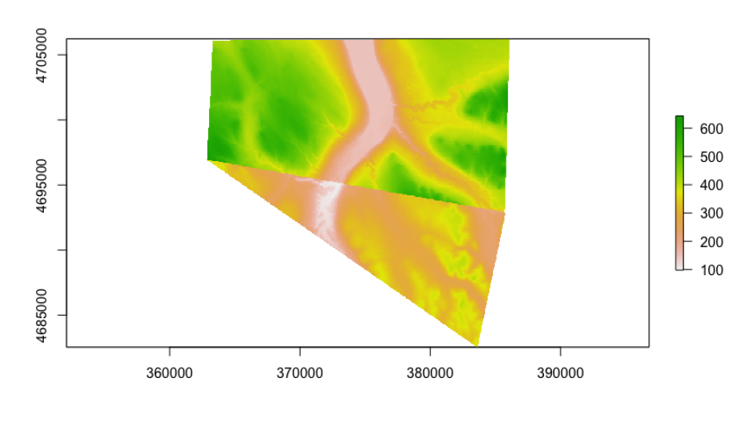

# Spatial Analysis with `sf` and `raster` in R

## Reading spatial data
### Vector
Read in vector data with `sf` package and `st_read()`

- formats: Shapefiles, GeoJson, GPS, netCDF
- wirte vector data: `st_write()`

Vector spatial objects are data frames, while `sf` data frames have special properties:

- They include spatial metadata like the coordinate reference system
- The geometry is stored in a list column
  - the list column allows you to store far more information in a single variable
  - use `as_tibble()` to convert data frame to a tibble and print friendly


#### Extracting geometric information from vector layers
The functions `st_area()` and `st_length()` return the area and length of features.

But the result is a `units` object that requires a little additional processing, which means the vector result is accompanied by metadata describing the object's units. 

Therefore, code like this won't quite work:

```
# This will not work
result <- st_area(parks)
result > 30000
```

Instead you need to either remove the units with `unclass()`, or you need to convert `val`'s class to `units`, for example:

```
# This will work
val <- 30000
unclass(result) > val

# This will work
units(val) <- units(result)
result > val
```

#### Plotting vectors
The `plot()` function, when applied to `sf` objects, will create a set of maps, one for each attribute in your data. Instead, if you want to create a map of a single attribute you can extract that attribute using, as an example, `plot(data["variable"])`.

Frequently you just want to plot the raw geometry with no attribute color-coding, for this, you can use the `st_geometry()` function to extract the geometry and plot the result.

```
parks <- st_read("parks.shp")
areas <- st_area(parks)

# Filter to parks greater than 30000 (square meters)
big_parks <- parks %>% 
  filter(unclass(areas) > 30000)

# Plot just the geometry of big_parks
plot(st_geometry(big_parks))
```


### Raster
Read in raster data with `raster` package

- formats: GeoTIFF, Esri grids, ENVI grids, ERDAS grids
- read single-band rasters: `raster()`
- read multi-band rasters: `brick()`

Once you read in raster data, they'll be stored as objects with the class RasterLayer or RasterBrick.

```
canopy <- raster("canopy.tif")
manhattan <- brick("manhattan.tif")

# Get the class for the new objects
class(canopy)
[1] "RasterLayer"
attr(,"package")
[1] "raster"

class(manhattan)
[1] "RasterBrick"
attr(,"package")
[1] "raster"

# Identify how many layers each object has
nlayers(canopy)
[1] 1
nlayers(manhattan)
[1] 3
```


#### Note when importing rasters...
Raster data can be very big depending on the extent and resolution (grid size). In order to deal with this, the `raster()` and `brick()` functions are designed to only read in the actual raster values as needed.

Therefore, `raster()` and `brick()` do not read in raster values by default. To conserve memory, raster values are imported only when required.


If you use the `head()` function, the raster package will read in only the values needed, not the full set of values.

The raster values will be read in by default if you perform spatial analysis operations that require it, or you can read in the values from a raster manually with the function `getValues()`.

- Use `inMemory()` to tell if the raster values have been read into R. It will return FALSE if the values are not in memory

- Read the values with the `getValues()` function


#### Other functions
Instead of storing raster objects in data frames, the raster package stores spatial data in specially designed R classes that contain slots where the data and metadata are stored. The data and metadata can be accessed using a suite of functions. 

- `extent()` to get the minimum and maximum X and Y coordinates of the raster
- `ncell()` and `nlayers()` to get the total number of grid cells or layers, respectively
- `crs()` to get the coordinate reference system
- `writeRaster()` to write raster data

#### Creating quick maps of your rasters with `plot()` and `plotRGB()`
- use `plot()` for single-band rasters or to look at the individual layers in a multi-band raster
- use `plotRGB()` to create a **true color** map of a multi-layered object


## Preparing layers for spatial analysis
### Corrdinate reference system (CRS)
Vector and raster spatial data was created based on a specific CRS. Usually the spatial file has metadata defining the CRS, but sometimes there is not.

**Projected vs unprojected CRS**

- An unprojected CRS uses latitude and longitude coordinates and references the earth as a three-dimensional object
- A projected CRS uses X and Y coordinates as a two-dimensional representation of the earth

#### Print out the CRS
- `sf` package: `st_crs()` prints out a vector object's CRS
- `raster` package: `crs()` prints out a raster object's CRS

To determine if your object has a projected CRS, you can look at the first part of the result from `st_crs()` or `crs()` -- **if it begins with `+proj=longlat` then your CRS is unprojected**.

```
shape1 <- st_read("shape1.shp")
st_crs(shape1)
$epsg
[1] 4326

$proj4string
[1] "+proj=longlat +ellps=WGS84 +no_defs"

attr(,"class")
[1] "crs"
```

#### Define CRS with EPSG or proj4string
You can use either an EPSG or proj4string to define the CRS. A CRS might have both but might only need one.

- The **EPSG** code is a numeric representation of a CRS (e.g, 4326)
- The **proj4string** is a full set of parameters spelled out in a string (e.g., `+proj=longlat +ellps=WGS84 +no_defs`)

**With `st_crs()`**

- Define with the proj4string  
`st_crs(shape2) <- "+proj=longlat +ellps=WGS84 +no_defs"`

- Define with the EPSG code  
`st_crs(shape2) <- 4236`


**For a raster define with crs()**  
`crs(multiband) <- "+proj=utm +zone=18+datum=WGS84 +units=m +no_defs+ellps=WGS84 +towgs84=0,0,0"`

#### Change the CRS with `st_transform()` or `projectRaster()`
You mostly can't plot layers together if they don't have the same CRS.

- Use `st_transform()` to change the CRS for vectors
  - Note that you need `asText = TRUE` to force the `crs()` function from raster to output the CRS as a string.
  
- Use `projectRaster()` to change the CRS for rasters
  - Note that to use an EPSG with `projectRaster`, the syntax is `+init=epsg:32618`

```
# Transform the CRS for vector shapes
shape1_prj <- st_transform(shape1, crs = 32618)
shape1_prj <- st_transform(shape1, crs ="+proj=utm +zone=18 +ellps=WGS84 +datum=WGS84 +units=m +no_defs")

# Transform CRS of one layer to match another layer
shape1_prj <- st_transform(shape1, crs = crs(singleband, asText = TRUE))

# Transform the CRS for a raster
singleband_prj <- projectRaster(singleband, crs = "+proj=utm +zone=18 +ellps=WGS84 +datum=WGS84 +units=m +no_defs")
singleband_prj <- projectRaster(singleband, crs = "+init=epsg:32618")
```

### Manipulating vector layers
One important difference between `dplyr` with and without spatial data is that the resulting data frames will include the geometry variable unless you explicitly drop it with `st_set_geometry(data, NULL)`. 

**Dropping geometry from a data frame:**

```
tree_cnt <- count(trees, hood) %>%
  st_set_geometry(NULL)
```

**Join spatial and non-spatial data with `inner_join()`**

```
# tree_sm is spatial, dat is non-spatial
res <- inner_join(tree_sm, dat, by = c("hood" = "hood_dat"))
```

**Simplify with `st_simplify()`**

- Compute the size in megabytes

```
library(pryr)
object_size(county)
489 kB
```

- Calculate number of vertices

```
# "cast" our polygons to bundles of points -- "MULTIPOINT" then count
pts <- st_cast(county$geometry, "MULTIPOINT")
sum(sapply(pts, length))
[1] 57886
```

**`st_simplify()`**

Tolerance controls simplification: bigger numbers mean more simplification, units are the units of the CRS. 

Use the `preserveTopology = TRUE` argument so that borders stay aligned.

`boro_simp <- st_simplify(boro, dTolerance = 500)`


### Converting `sf` objects between `sp` and raw coordinates
**Convert `sf` objects to `sp` with `as()`**

The class for `sp` objects is `Spatial`.

```
# Our sf object
polys <- st_read("polygons.shp")
class(polys)
[1] "sf"     "data.frame"

# Convert to Spatial object
polys_sp <- as(polys, Class = "Spatial")

class(polys_sp)
[1] "SpatialPolygonsDataFrame"
attr(,"package")
[1] "sp"
```

**Convert from `sp` to `sf` with `st_as_sf()`**

```
# Convert from sp to sf object
polys_sf <- st_as_sf(polys_sp)

class(polys_sf)
[1] "sf"         "data.frame"
```

#### Converting to and from coordinates
The `coords` argument specifies the coordinate columns and **must be in longitude,latitude or X, Y order**.

```
# Simple dataframe with coordinates
pts <- data.frame(
  ID = 1:2,
  lon = c(-73, -72),
  lat = c(41, 42)
  )

# Convert to an sf object
pts <- st_as_sf(pts, coords = c("lon", "lat"))

pts
# Simple feature collection with 2 features and 1 field
# geometry type:  POINT
# dimension:      XY
# bbox:           xmin: -73 ymin: 41 xmax: -72 ymax: 42
# epsg (SRID):    NA
# proj4string:    NA
# ID       geometry
# 1  1 POINT (-73 41)
# 2  2 POINT (-72 42)
```

#### Specify the CRS with either a proj4string or a EPSG code

```
# WGS 84 with a proj4string
st_as_sf(pts,
  coords = c("lon", "lat"),
  crs = "+proj=longlat +ellps=WGS84 +datum=WGS84 +no_defs"
  )
```

With long/lat you can probably use EPSG = 4326 (WGS 84)

```
# WGS 84 with an EPSG code
st_as_sf(pts, coords = c("lon", "lat"), crs = 4326)
```

#### Write your points to a CSV with coordinates

If you want to convert your `sf` point objects to a data frame with coordinates, you can use the `st_write()` function with a hidden argument.

These are arguments associated with an external utility called GDAL, and so they're not in the R help.

- Writing to other spatial formats like shapefiles is easy with `st_write()`
- If you use `st_write()` with points and specify a CSV, coordinates won't be included
- Use a "hidden" argument, `layer_options` to write coordinates  
  `st_write(pts, "pts.csv", layer_options = "GEOMETRY=AS_XY")`

Note that `st_write()` can also be used to write lines and polygons, but it wouldn't make sense to write these out with coordinates in the same format.

### Manipulating raster layers
#### Reduce raster resolution
For rasters, the function to reduce resolution is `aggregate()`, which, as you might guess, aggregates grid cells into larger grid cells using a user-defined function.

The function used to aggregate the values is determined by the `fun` argument (the default being `mean`), and the amount of aggregation is driven by the `fact` (the default being `2`) argument.

```
elevation <- raster("elevation.tif")
# Determine the number of cells
ncell(elevation)
[1] 6204900

# Determine the raster resolution
res(elevation)
[1] 23 29

file.size("elevation.tif")
[1] 24847179 # ~ 25 megabytes

plot(elevation)

dem_low <- aggregate(dem, fact = 20, fun = mean)

ncell(dem_low)
[1] 15540
res(dem_low)
[1] 455 590

writeRaster(dem_low, "elevation-small.tif")
file.size("elevation-small.tif")
[1] 106235 # 0.11 megabytes
```

#### Reclassify raster values
There are many situations where you might need to change raster values. You may want to change outlier values to `NA` for example. In the `raster` package, reclassification is performed with the `reclassify()` function.

**Here we use a 2-column matrix to change values of 5 to 100**

```
# Set up the matrix
new_vals <- cbind(5, 100)

# Reclassify
new_rast <- reclassify(old_raster, rcl = new_vals)
```

**Here we use a 3-column matrix to change values between 100 and 300 to NA**

```
# Set up the matrix
vals <- cbind(100, 300, NA)

# Reclassify
canopy_reclass <- reclassify(canopy, rcl = vals)
```

**Reclassify values into three groups**

```
# Values between 0 and 0.25 become 1 and so on
m <- c(
  0.00, 0.25, 1,
  0.25, 0.50, 2,
  0.50, 1.00, 3
  )
rclmat <- matrix(m, ncol = 3, byrow = TRUE)
rc <- reclassify(r, rclmat)
```

## Conducting spatial analysis
### Buffers and centroids
#### Buffer layers
Computing buffers is a key spatial analysis skill and the resulting buffers have a wide range of uses like, for example, identifying the number of roads within one kilometer of a school, or computing the number of hazardous waste sites near sensitive natural areas.

The buffer distance will be more meaningful with a projected CRS, so it is highly recommended that you transform unprojected data to a projected CRS before buffering.

- As a general rule, your layers should use a projected CRS
- With multiple layers, they should have the same CRS
- The `dist` argument controls the radius and is in CRS units

```
# Convert the data frame to an sf object             
df_sf <- st_as_sf(
  df,
  coords = c("longitude", "latitude"),
  crs = 4326
  )

# Transform the points to match the manhattan CRS
df_crs <- st_transform(
  df_sf,
  crs = crs(manhattan, asText = TRUE)
  )

# Buffer the points
df_buf <- st_buffer(df_crs, dist = 1000)
```

#### Compute polygon centroids
Similar to buffering, computing polygon centroids is a bedrock geoprocessing task used to assign values and even to help with labeling maps. The function for this in `sf` is `st_centroid()`.

Also similar to buffering, centroid calculations should generally be performed on data with a projected coordinate reference system.

`poly_cent <- st_centroid(poly)`

### Bounding boxes, dissolve

#### Defining a region
**1. Rectangular bounding box**

You can compute bounding boxes around vector data using `sf`. These can help you, for example, create polygons to clip layers to a common area for an analysis or identify regions of influence.

***Compute the coordinates of the bounding box with `st_bbox()`***

```
# Read data in and get the bbox coords
poly <- st_read("poly.shp")

# Compute the bounding box coordinates
st_bbox(poly)
xmin ymin xmax ymax
913090.8 120053.5 1067383.5 272932.1
```

***Create a bounding box***

`st_make_grid()` can be used to make a multi-row and multi-column grid covering your input data, but it can also be used to make a grid of just one cell (a bounding box). To do this, you need to specify the number of grid cells as `n = 1`.

```
# Bounding box of counties in red
poly_grd <- st_make_grid(
  poly, n = 1
  )
  
# Bounding box of centroids in green
cent_grd <- st_make_grid(
  poly_cent, n = 1
  )
```

**2. Tighter polygon with a convex hull**

***Dissolve features into one with `st_union()`***

- For polygons, you dissolve multiple features into a single feature
- For points, you cluster individual points into a MULTIPOINT geometry

If you have a set of points and you want to draw a convex hull around them, you first need to bundle the points into a single MULTIPOINT feature.

With polygons, `st_union()` will dissolve all the polygons into a single polygon representing the area where all the polygons overlap.

`grds_union <- st_union(polys)`

***Compute a tight bounding box called a convex hull***

When computing a convex hull, you'll need to remember to first dissolve/union/combine your individual features into a multi-feature. When you used `head()` you should have noticed that you started with “POINT” objects and after `st_union()` you had “MULTIPOINT”.

```
# Convert the points to a single multi-point
beech1 <- st_union(beech)

# Compute the tight bounding box
beech_hull <- st_convex_hull(beech1)

# Plot the points together with the hull
plot(beech_hull, col = "red")
plot(beech1, add = TRUE)
```

### Multi-layer geoprocessing
- Linking features from multiple layers (e.g., spatial join)
- Determine relationships between features from different layers (e.g., intersect, distance)

#### Spatial join
For many analysis types, you need to link geographies spatially. For example, you want to know how many trees are in each neighborhood, but you don't have a neighborhood attribute in the tree data. The best way to do this is with a spatial join using `st_join()`.

Importantly, the `st_join()` function requires `sf` data frames as input, and **will not** accept an object that is just `sf` geometry. 

You can use the `st_sf()` function to convert sf geometry objects to an `sf` data frame (`st_sf()` is essentially the opposite of `st_geometry()`).

With `st_join()`, the first argument is the object you want as an output, and the second is the object with the attributes you want added.

```
# Join the roads to the tract oolygons
roads <- st_join(roads, tracts)
```

#### Spatial relationships between multiple layers
The output of related functions is a special kind of list (with the class `sgbp`). 

**Looking at intersection with `st_intersects()`**

For example, when using `st_intersects()`, the first element in the output can be accessed using `[[1]]`, which shows polygons from the second polygon that intersect with the first polygon.

Likewise, `[[2]]` would show the polygons from the first polygon that intersect with the second polygon.

```
# Determine which roads intersect with the tract polygon
# Result is an R list with one element per polygon feature
intersects <- st_intersects(tract, roads)[[1]]

# The index number of roads that intersect
head(intersects)
[1] 1 2 6 12 15 19

plot(st_geometry(roads[intersects,]), add = TRUE, col = "red")
```

**Looking at contains with `st_contains()`**

```
contains <- st_contains(tract, roads)[[1]]
plot(st_geometry(roads[contains,]), add = TRUE, col = "blue")
```

**Clip features with `st_intersection()`**

```
# Clip the roads to match the tract polygon
clipped <- st_intersection(tract, roads)

plot(st_geometry(tract), col = "grey", border = "white")
plot(st_geometry(clipped), add = TRUE)
```

**Compute distance with `st_distance()`**

There are several functions in `base` R as well as in the packages `rgeos` and `geosphere` to compute distances, but the `st_distance()` function from `sf` provides a useful feature-to-feature distance matrix as output, and can be used for most distance calculation needs.

`dist1 <- st_distance(tract_cent, roads)`  
The result will be a distance from each feature to each feature as a matrix.

```
# Read in the parks object
parks <- st_read("parks.shp")

# Test whether the CRS match
st_crs(empire_state) == st_crs(parks)

# Project parks to match empire state
parks_es <- st_transform(parks, crs = st_crs(empire_state))

# Compute the distance between empire_state and parks_es
d <- st_distance(empire_state, parks_es)

# Take a quick look at the result
head(d)

# Find the index of the nearest park
nearest <- which.min(d)

# Identify the park that is nearest
parks_es[nearest, ]
```

### Geoprocessing with rasters
Mask and crop are similar operations that allow you to limit your raster to a specific area of interest.

With `mask()` you essentially place your area of interest on top of the raster and any raster cells outside of the boundary are assigned `NA` values.

A reminder that currently the raster package does not support `sf` objects, so they will need to be converted to `Spatial` objects with, for example, `as(input, "Spatial")`.

#### Mask and crop
**Mask your raster with `mask()`**

```
polys <- as(polys, "Spatial")
el_mask <- mask(elevation, mask = polys)
```

Example:

```
# Project parks to match canopy
parks_cp <- st_transform(parks, crs = crs(canopy, asText = TRUE))

# Compute the area of the parks
areas <- st_area(parks_cp)

# Filter to parks with areas > 30000
parks_big <- filter(parks_cp, unclass(areas) > 30000)

# Convert parks to a Spatial object
parks_sp <- as(parks_big, "Spatial")

# Mask the canopy layer with parks_sp and save as canopy_mask
canopy_mask <- mask(canopy, mask = parks_sp)

# Plot canopy_mask -- this is a raster!
plot(canopy_mask)
```

**Crop your raster with `crop()`**

As you saw in the previous exercise with `mask()`, the raster extent is not changed, but all raster values outside the mask are set to `NA`.

With `crop()`, you are cropping the raster so that the extent (the bounding box) of the raster matches the extent of the input crop layer. But within the bounding box, no masking is done (no raster cells are set to `NA`).

`el_crop <- crop(elevation, polys)`:  
the extent of *elevation* is cropped to match the extent of *polys* but no masking is done.

**Mask and crop**

```
el_crop <- crop(elevation, polys)
el_mask <- mask(el_crop, mask = polys)

plot(el_mask)
```

#### Extract values with `extract()`
Beyond simply masking and cropping, you may want to know the actual cell values at locations of interest. 

- With points, the raster values under each point are returned
- With polygons, you have two options controlled by the `fun` argument:
  - Return all values in each polygon (`fun = NULL`)
  - Supply a summary function (e.g., `fun = mean`)
  - In all cases, the returned object is a list with an element for each polygon

```
# For polys fun = NULL will return all values
vals <- extract(elevation, polys, fun = mean)

vals
#         [,1]
# [1,] 471.1458 # hill polygon
# [2,] 203.4773 # lake polygon
```



#### Raster math with `overlay()`



```
f <- function(rast1, rast2) rast1 * rast2
alt_ele <- overlay(elevation, multiplier, fun = f)
```

**Result:**  
Elevation values have been multiplied by either 1.25 or 0.75 depending on their location. Otherwise raster values are set to `NA`.


