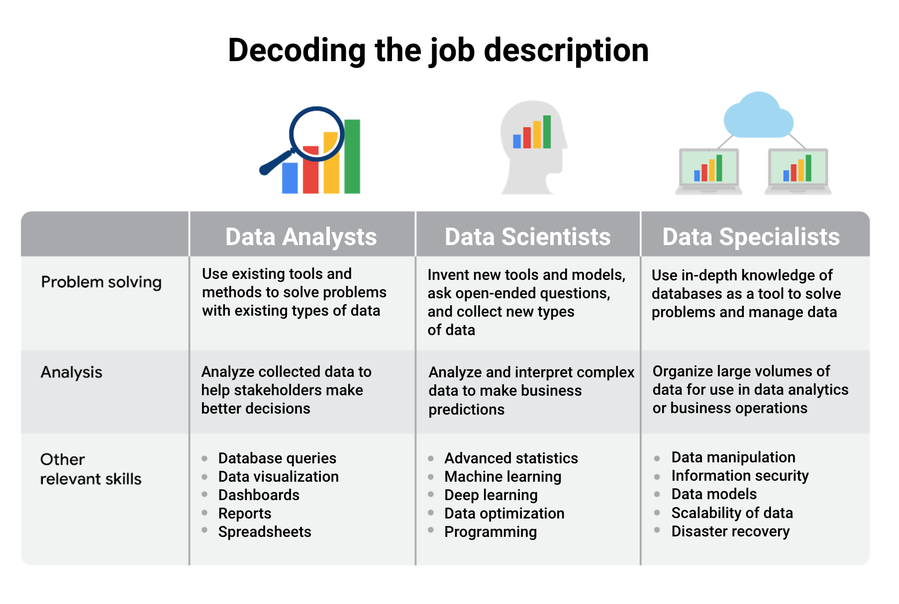
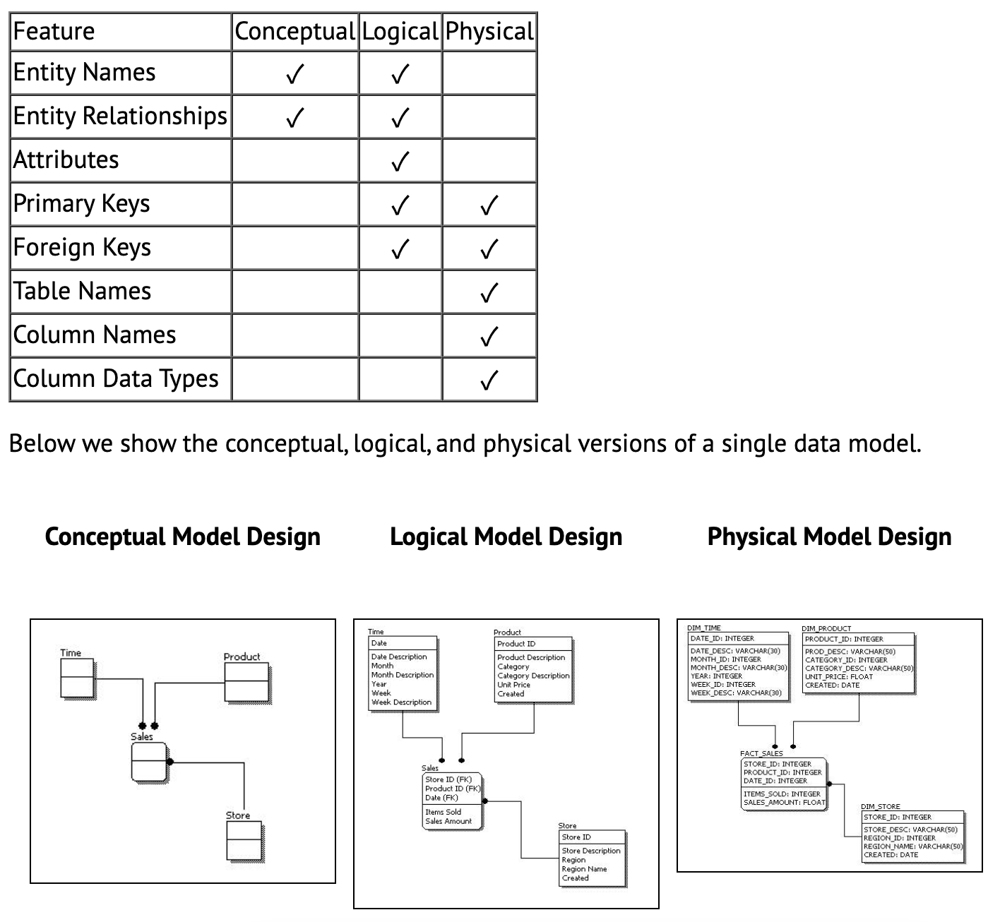

## Thinking analytically

**Data ecosystems**: made up of various elements that interact with one another in order to produce, manage, store, organize, analyze, and share data.

### **Data analysis phases:**

1.  **Ask** questions and define the problem

    -   Define the problem you're trying to solve
    -   Make sure you fully understand the **stakeholder's expectations**
    -   Focus on the actual problem and avoid any distractions
    -   Collaborate with stakeholders and keep an open line of communication
    -   Take a step back and see the whole situation in **context**
    -   What are my stakeholders saying their problems are?
    -   Now that I've identified the issues, how can I help the stakeholders resolve their questions?

2.  **Prepare** data by collecting and storing the information

    -   What **metrics** to measure
    -   **Locate** data in your database
    -   Create **security** measures to protect that data
    -   What do I need to figure out how to solve this problem?
    -   What research do I need to do?

3.  **Process** data by cleaning and checking the information

    -   Using spreadsheet functions to find **incorrectly** entered data
    -   Using SQL functions to check for extra spaces
    -   Removing **repeated** entries 
    -   Determining if your data is biased
    -   What **data errors** or **inaccuracies** might get in my way of getting the best possible answer to the problem I am trying to solve?
    -   How can I clean my data so the information I have is more consistent?

4.  **Analyze** data to find patterns, relationships, and trends

    -   Perform calculations
    -   Combine data from multiple sources
    -   Create tables with your results
    -   What story is my data telling me?
    -   How will my data help me solve this problem?
    -   Who needs my company's product or service? What type of person is most likely to use it?

5.  **Share** data with your audience

    -   Make better decisions
    -   Make more informed decisions
    -   Lead to stronger outcomes
    -   Successfully communicate your findings
    -   How can I make what I present to the stakeholders engaging and easy to understand?
    -   What would help me understand this if I were the listener?

6.  **Act** on the data and use the analysis results.

    -   How can I use the feedback I received during the share phase (step 5) to actually meet the shareholder's needs and expectations?

These six steps can help you to break the data analysis process into smaller, manageable parts, which is called **structured thinking**. This process involves four basic activities:

1.  Recognizing the current problem or situation
2.  Organizing available information 
3.  Revealing gaps and opportunities
4.  Identifying your options

To get the most out of **data-driven decision-making**, it's important to include insights from people who are familiar with the business problem. These people are called **subject matter experts**, and they have the ability to look at the results of data analysis and identify any inconsistencies, make sense of gray areas, and eventually validate choices being made.

### **Analytical thinking**

involves identifying and defining a problem and then solving it by using data in an organized, step-by-step manner.

Five key skills in analytical thinking:

1.  **Curiosity** - a desire to know more about something, asking the right questions

2.  **Understanding context** - understanding where information fits into the "big picture"

3.  **Having a technical mindset** - breaking big things into smaller steps

4.  **Data design** - thinking about how to organize data and information

5.  **Data strategy** - thinking about the people, processes, and tools used in data analysis

The five key aspects to analytical thinking:

-   visualization
-   strategy
-   problem-orientation
-   correlation
-   big-picture and detail-oriented thinking

**Root cause**: Ask **Five Whys** to reveal the root cause

**Gap analysis**: lets you examine and evaluate how a process works currently in order to get where you want to be in the future. The general approach to gap analysis is understanding where you are now compared to where you want to be.

### **Data life cycle:**

-   **Plan** - What plans and decisions do you need to make? What data do you need to answer your question?
-   **Capture** - Where does your data come from? How will you get it?
-   **Manage** - How will you store your data? What should it be used for, and how do you keep this data secure and protected?
-   **Analyze** - How will the company analyze the data? What tools should they use?
-   **Archive** - What should they do with their data when it gets old? How do they know when it's time?
-   **Destroy** - Should they ever dispose of any data? If so, when and how?

The type of questions you ask as you begin this "deep dive" are very important. Some common questions are:

-   **Objectives**: What are the goals of this deep dive? What, if any, questions are expected to be answered?

-   **Audience**: Who are the stakeholders? Who is interested or concerned about the results of this deep dive? Who will you be presenting to?

-   **Time**: What is the time frame for completion? By what date does this need to be done?

-   **Resources**: What resources are available to accomplish the deep dive's goals?

-   **Security**: Who should have access to the information?

## Asking questions

### SMART questions

-   **Specific**: Questions are simple, significant, and focused on a single topic or a few closely related ideas.

-   **Measurable**: Questions can be quantified and assessed.

-   **Action-oriented**: Questions encourage change.

-   **Relevant**: Questions matter, are important, and have significance to the problem you're trying to solve.

-   **Time-bound**: Questions specify the time to be studied.

### Things to avoid when asking questions

Questions should be **open-ended.** This is the best way to get responses that will help you accurately qualify or disqualify potential solutions to your specific problem. 

Now, here are some types of questions that you should try to avoid as a data analyst:

**Leading questions**: questions that only have a particular response

-   Example: *"This product is too expensive, isn't it?"*

**Closed-ended questions**: questions that ask for a one-word or brief response only

-   Example: *"How was the customer trial?"*

**Vague questions:** questions that aren't specific or don't provide context

-   Example: *"Does that tool work for you?"*

A better question might be, "When it comes to data entry, how much time does the tool save you?" This question gives context (data entry) and helps frame responses that are measurable (time).

**When Creating questions:**

-   Avoid technical jargon.
-   Prioritize your questions: Ask the most important and impactful questions first to save time.
-   Make your time count: Stay on subject during the conversation.
-   Clarify your understanding: To avoid confusion, briefly summarizing the given answers to make sure you understood it correctly. This will go a long way in helping you avoid mistakes.

Take good notes:

-   **Facts**: Any concrete piece of information is usually worth writing down. Dates, times, names, and other specifics that pop up.
-   **Context**: Facts without context are useless. Note any relevant details that are needed in order to understand the information you gather.
-   **Unknowns**: Sometimes you may miss an important question during a conversation. Make a note when this happens so you know to figure out the answer later.

For example, if we had a conversation with an ice cream shop about collecting data on customer flavor preferences, our notes might appear something like this:

-   **Project**: Collect customer flavor preference data.
-   Overall **business goal**: Use data to create more popular flavors.
-   Two **data sources**: Cash register receipts and completed customer surveys (email).
-   Target **completion date**: Q2
-   **To do**: Call back later and speak with the manager about the location of survey data.

### Problem Types

Data analysts typically work with six problem types:

1.  Making predictions
2.  Categorizing things
3.  Spotting something unusual
4.  Identifying themes
5.  Discovering connections
6.  Finding patterns

### Types of dashboards

1.  **Strategic**: Focuses on long term goals and strategies at the highest level of metrics
2.  **Operational**: Short-term performance tracking and intermediate goals
3.  **Analytical**: Consists of the datasets and the mathematics used in these sets

### Data cycle for spreadsheets

-   **Plan** for the users who will work within a spreadsheet by developing organizational standards. This can mean formatting your cells, the headings you choose to highlight, the color scheme, and the way you order your data points. When you take the time to set these standards, you will improve communication, ensure consistency, and help people be more efficient with their time.

-   **Capture** data by the source by connecting spreadsheets to other data sources, such as an online survey application or a database. This data will automatically be updated in the spreadsheet. That way, the information is always as current and accurate as possible.

-   **Manage** different kinds of data with a spreadsheet. This can involve storing, organizing, filtering, and updating information. Spreadsheets also let you decide who can access the data, how the information is shared, and how to keep your data safe and secure. 

-   **Analyze** data in a spreadsheet to help make better decisions. Some of the most common spreadsheet analysis tools include formulas to aggregate data or create reports, and pivot tables for clear, easy to understand visuals. 

-   **Archive** any spreadsheet that you don't use often, but might need to reference later with built-in tools. This is especially useful if you want to store historical data before it gets updated. 

-   **Destroy** your spreadsheet when you are certain that you will never need it again, if you have better backup copies, or for legal or security reasons. Keep in mind, lots of businesses are required to follow certain rules or have measures in place to make sure data is destroyed properly.

### Working with stakeholders

**Stakeholders** are people who have invested time, interest, and resources into the projects that you are working on.

There are three common stakeholder groups that you might find yourself working with: the executive team, the customer-facing team, and the data science team.

### Lead great meetings

1.  **Before the meeting**

If you are organizing the meeting, you will probably talk about the data. Before the meeting:

-   **Identify your objective**. Establish the purpose, goals, and desired outcomes of the meeting, including any questions or requests that need to be addressed.

-   Acknowledge participants and keep them involved with different points of view and experiences with the data, the project, or the business.

-   Organize the data to be presented. You might need to turn raw data into accessible formats or create data visualizations.

-   Prepare and distribute an agenda. We will go over this next.

2.  **Crafting a compelling agenda**

Here are the basic parts your agenda should include: 

-   Meeting start and end time
-   Meeting location (including information to participate remotely, if that option is available)
-   Objectives
-   Background material or data the participants should review beforehand

3.  **Sharing your agenda ahead of time**

After writing your agenda, it's time to share it with the invitees. Sharing the agenda with everyone ahead of time helps them understand the meeting goals and prepare questions, comments, or feedback.

4.  **During the meeting**

As the leader of the meeting, it's your job to guide the data discussion. With everyone well informed of the meeting plan and goals, you can follow these steps to avoid any distractions:

-   Make introductions (if necessary) and review key messages
-   Present the data
-   Discuss observations, interpretations, and implications of the data
-   Take notes during the meeting
-   Determine and summarize next steps for the group 

5.  **After the meeting**

To keep the project and everyone aligned, prepare and distribute a brief recap of the meeting with next steps that were agreed upon in the meeting. You can even take it a step further by asking for feedback from the team.

-   Distribute any notes or data
-   Confirm next steps and timeline for additional actions
-   Ask for feedback (this is an effective way to figure out if you missed anything in your recap)

## Preparing data

### Data formats

-   Primary vs. Secondary
-   Internal vs. External
-   Continuous vs. Discrete
-   Qualitative vs. Quantitative
-   Nominal vs. Ordinal
-   Structured vs. Unstructured

### **Data modeling**

Data modeling is the process of creating diagrams that visually represent how data is organized and structured. These visual representations are called data models. You can think of data modeling as a blueprint of a house.

**Levels of data modeling**:

1.  **Conceptual** data modeling gives you a high-level view of your data structure, such as how you want data to interact across an organization
2.  **Logical** data modeling focuses on the technical details of the model such as relationships, attributes, and entities.
3.  **Physical** data modeling should actually depict how the database was built. By this stage, you are laying out how each database will be put in place and how the databases, applications, and features will interact in specific detail.

Reference: <https://www.1keydata.com/datawarehousing/data-modeling-levels.html>

**Basic data modeling techniques:**

-   ER Diagrams
-   UML Class Diagrams
-   a Data Dictionary

1.  **Entity-Relationship modeling** is a default technique for modeling and the design of relational (traditional) databases.

**ERDs** work well if you want to design a relational (classic) database, Excel databases or CSV files. Basically, any kind of tabular data. They work well for visualization of database schemas and communication of top-level view of data.

2.  **UML (Unified Modeling Language)** is a standardized family of notations for modeling and design of information systems.

You can use class diagrams to design a tabular data (such as in RDBMS), but were designed and are used mostly for object-oriented programs (such as Java or C\#).

3.  **Data dictionaries** are a tabular definition/representation of data assets. Data dictionary is an inventory of data sets/tables with the list of their attributes/columns.

Data dictionary is suitable as detailed specification of data assets and can be supplemented with ER diagrams, as both serve slightly different purpose.

Reference: <https://dataedo.com/blog/basic-data-modeling-techniques>

### Data bias

-   **Observer** bias

    -   sometimes referred to as experimenter bias or research bias
    -   the tendency for different people to observe things differently

-   **Interpretation** bias

    -   the tendency to always interpret ambiguous situations in a positive, or negative way

-   **Confirmation** bias

    -   the tendency to search for, or interpret information in a way that confirms preexisting beliefs

### Good data

Who created the data set? Is it part of a credible organization?When was the data last refreshed? If you have original data from a reliable organization and it's comprehensive, current, and cited, it **ROCCC**s!

-   **Reliable** data from a reliable organization
-   Original
-   Comprehensive
-   Current
-   Cited

### Data ethics

Ethics refers to well-founded **standards of right and wrong** that prescribe what humans ought to do, usually in terms of rights, obligations, benefits to society, fairness, or specific virtues.

Aspects of data ethics:

-   **Ownership**

    -   It's individuals who own the raw data they provide, and they have primary control over its usage, how it's processed, and how it's shared.

-   **Transaction transparency**

    -   all data processing activities and algorithms should be completely explainable and understood by the individual who provides their data
    -   in response to concerns over data bias

-   **Consent**

    -   an individual's right to know explicit details about how and why their data will be used before agreeing to provide it

-   **Currency**

    -   Individuals should be aware of financial transactions resulting from the use of their personal data and the scale of these transactions

-   **Privacy**

-   **Openness**

### Data privacy

Privacy means preserving a data subject's information and activity any time a data transaction occurs.

-   protection from unauthorized access to our private data
-   freedom from inappropriate use of our data
-   the right to inspect, update, or correct our data
-   ability to give consent to use our data
-   legal right to access our data

Here is a list of data that is often anonymized:

-   Telephone numbers
-   Names
-   License plates and license numbers
-   Social security numbers
-   IP addresses
-   Medical records
-   Email addresses
-   Photographs
-   Account numbers

### Open data

In data analytics, **open data** is part of **data ethics,** which has to do with using data ethically. **Openness** refers to free access, usage, and sharing of data. But for data to be considered open, it has to be:

-   Available and accessible to the public as a complete dataset
-   Provided under terms that allow it to be reused and redistributed
-   Allows **universal participation** so that anyone can use, reuse, and redistribute the data

**PII and licensing, third party data, and privacy**

**Third party data** is collected by an entity that doesn't have a direct relationship with the data. For example, third parties might collect information about visitors to a certain website. Doing this lets these third parties create "audience profiles," which helps them better understand user behavior, and target them with more effective advertising. 

**Personal Identifiable Information (PII)** is data that is reasonably likely to identify a person and make information known about them. We all want to keep this type of information about ourselves private. So it is important to find a balance between privacy and openness in public data.

**Ethical data use:**

-   Be self-reflect and understand what it is that you're doing and the impact that it has

## Databases

A **normalized** database is a database in which only related data is stored in each table. The main idea behind **database normalization** is that a table should be about a specific topic and only include supporting related data.

### Database structures using schemas

Relational databases can also be organized in different ways according to schemas. A **schema** is a way of describing how something is organized.

Schemas are useful when you are learning about a new data set or designing a relational database. A **database schema** represents any kind of structure that we apply to the database. At the most basic level, a database schema tells us which tables or relations make up the database, plus the fields included in each table.

Two commonly used schemas are star schemas and snowflake schemas.

-   **星型模型 Star schema:** A **star schema** is a schema with one or more fact tables referencing any number of dimension tables. As its name suggests, this schema is shaped like a star. You can also imagine the fact table as the sun at the center of a solar system, with the dimension tables as the planets orbiting the sun. By design, star schemas let data analysts process data and get results from a database quickly. This type of schema is **best for high-scale information delivery** because it makes read output more efficient.

-   **雪花模型 Snowflake schema:** A **snowflake schema** is an extension of a star schema with more dimensions and even sub-dimensions, too. These dimensions and sub-dimensions create a snowflake pattern. Like real snowflakes, a snowflake schema---and the relationships within it---can be complex. Snowflake schemas are an organization type **designed for lightning-fast data processing**.
