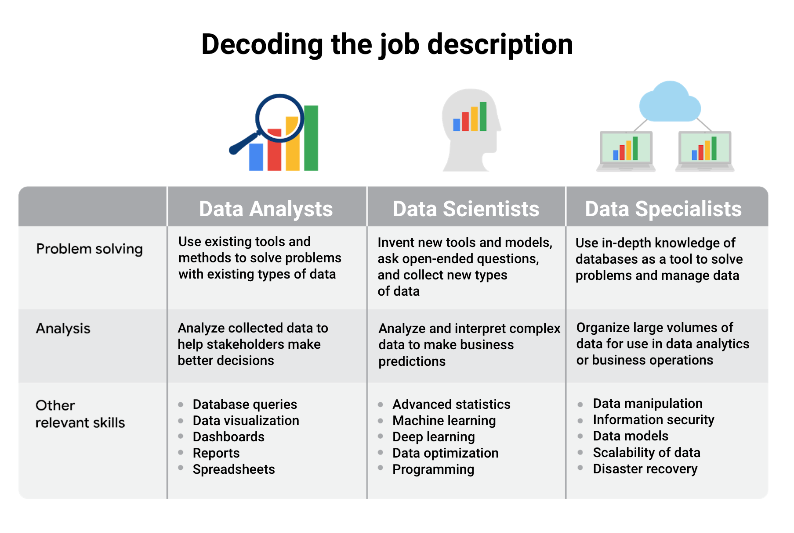
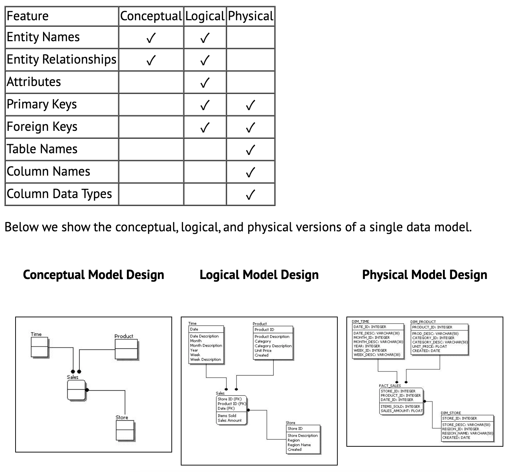

{width="800"}

**Data ecosystems**: made up of various elements that interact with one
another in order to produce, manage, store, organize, analyze, and share
data.

#### **Data-driven decision making:**

1.  **Ask** questions and define the problem
2.  **Prepare** data by collecting and storing the information
3.  **Process** data by cleaning and checking the information
4.  **Analyze** data to find patterns, relationships, and trends
5.  **Share** data with your audience
6.  **Act** on the data and use the analysis results.

To get the most out of data-driven decision-making, it's important to
include insights from people who are familiar with the business problem.
These people are called **subject matter experts**, and they have the
ability to look at the results of data analysis and identify any
inconsistencies, make sense of gray areas, and eventually validate
choices being made.

{width="800"}

#### **Analytical thinking**

involves identifying and defining a problem and then solving it by using
data in an organized, step-by-step manner.

Five key skills in analytical thinking:

1.  **Curiosity** - a desire to know more about something, asking the
    right questions
2.  **Understanding context** - understanding where information fits
    into the "big picture"
3.  **Having a technical mindset** - breaking big things into smaller
    steps
4.  **Data design** - thinking about how to organize data and
    information
5.  **Data strategy** - thinking about the people, processes, and tools
    used in data analysis

The five key aspects to analytical thinking:

-   visualization
-   strategy
-   problem-orientation
-   correlation
-   big-picture and detail-oriented thinking

**Root cause**: Ask **Five Whys** to reveal the root cause

**Gap analysis**: lets you examine and evaluate how a process works
currently in order to get where you want to be in the future. The
general approach to gap analysis is understanding where you are now
compared to where you want to be.

#### **Data life cycle:**

-   **Plan** - What plans and decisions do you need to make? What data
    do you need to answer your question?
-   **Capture** - Where does your data come from? How will you get it?
-   **Manage** - How will you store your data? What should it be used
    for, and how do you keep this data secure and protected?
-   **Analyze** - How will the company analyze the data? What tools
    should they use?
-   **Archive** - What should they do with their data when it gets old?
    How do they know when it's time?
-   **Destroy** - Should they ever dispose of any data? If so, when and
    how?

The type of questions you ask as you begin this "deep dive" are very
important. Some common questions are:

-   **Objectives**: What are the goals of this deep dive? What, if any,
    questions are expected to be answered?

-   **Audience**: Who are the stakeholders? Who is interested or
    concerned about the results of this deep dive? Who will you be
    presenting to?

-   **Time**: What is the time frame for completion? By what date does
    this need to be done?

-   **Resources**: What resources are available to accomplish the deep
    dive's goals?

-   **Security**: Who should have access to the information?

#### SMART questions

-   **Specific**: Questions are simple, significant, and focused on a
    single topic or a few closely related ideas.
-   **Measurable**: Questions can be quantified and assessed.
-   **Action-oriented**: Questions encourage change.
-   **Relevant**: Questions matter, are important, and have significance
    to the problem you're trying to solve.
-   **Time-bound**: Questions specify the time to be studied.

When Creating questions:

-   Avoid technical jargon.
-   Prioritize your questions: Ask the most important and impactful
    questions first to save time.
-   Make your time count: Stay on subject during the conversation.
-   Clarify your understanding: To avoid confusion, briefly summarizing
    the given answers to make sure you understood it correctly. This
    will go a long way in helping you avoid mistakes.

Take good notes:

-   **Facts**: Any concrete piece of information is usually worth
    writing down. Dates, times, names, and other specifics that pop up.
-   **Context**: Facts without context are useless. Note any relevant
    details that are needed in order to understand the information you
    gather.
-   **Unknowns**: Sometimes you may miss an important question during a
    conversation. Make a note when this happens so you know to figure
    out the answer later.

For example, if we had a conversation with an ice cream shop about
collecting data on customer flavor preferences, our notes might appear
something like this:

-   Project: Collect customer flavor preference data.
-   Overall business goal: Use data to create more popular flavors.
-   Two data sources: Cash register receipts and completed customer
    surveys (email).
-   Target completion date: Q2
-   To do: Call back later and speak with the manager about the location
    of survey data.

#### Types of dashboards

1.  **Strategic**: Focuses on long term goals and strategies at the
    highest level of metrics
2.  **Operational**: Short-term performance tracking and intermediate
    goals
3.  **Analytical**: Consists of the datasets and the mathematics used in
    these sets

#### Data formats

-   Primary vs. Secondary
-   Internal vs. External
-   Continuous vs. Discrete
-   Qualitative vs. Quantitative
-   Nominal vs. Ordinal
-   Structured vs. Unstructured

{width="800"}

{width="800"}

#### **Data modeling**

Data modeling is the process of creating diagrams that visually
represent how data is organized and structured. These visual
representations are called data models. You can think of data modeling
as a blueprint of a house.

**Levels of data modeling**:

1.  **Conceptual** data modeling gives you a high-level view of your
    data structure, such as how you want data to interact across an
    organization
2.  **Logical** data modeling focuses on the technical details of the
    model such as relationships, attributes, and entities.
3.  **Physical** data modeling should actually depict how the database
    was built. By this stage, you are laying out how each database will
    be put in place and how the databases, applications, and features
    will interact in specific detail.

{width="800"}

Reference:
<https://www.1keydata.com/datawarehousing/data-modeling-levels.html>

**Basic data modeling techniques:**

-   ER Diagrams
-   UML Class Diagrams
-   a Data Dictionary

1.  **Entity-Relationship modeling** is a default technique for modeling
    and the design of relational (traditional) databases.

**ERDs** work well if you want to design a relational (classic)
database, Excel databases or CSV files. Basically, any kind of tabular
data. They work well for visualization of database schemas and
communication of top-level view of data.

2.  **UML (Unified Modeling Language)** is a standardized family of
    notations for modeling and design of information systems.

You can use class diagrams to design a tabular data (such as in RDBMS),
but were designed and are used mostly for object-oriented programs (such
as Java or C\#).

3.  **Data dictionaries** are a tabular definition/representation of
    data assets. Data dictionary is an inventory of data sets/tables
    with the list of their attributes/columns.

Data dictionary is suitable as detailed specification of data assets and
can be supplemented with ER diagrams, as both serve slightly different
purpose.

