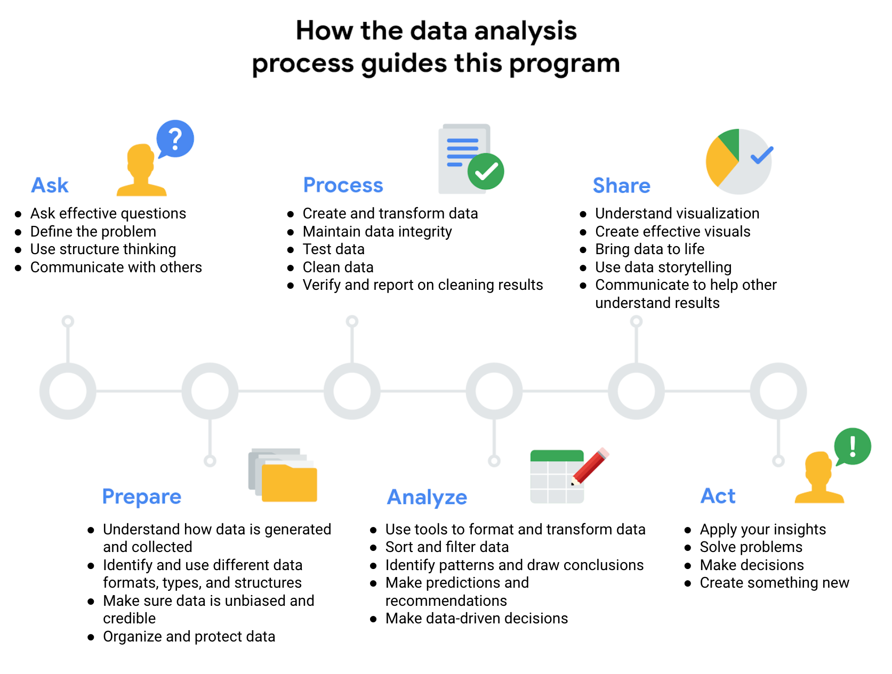
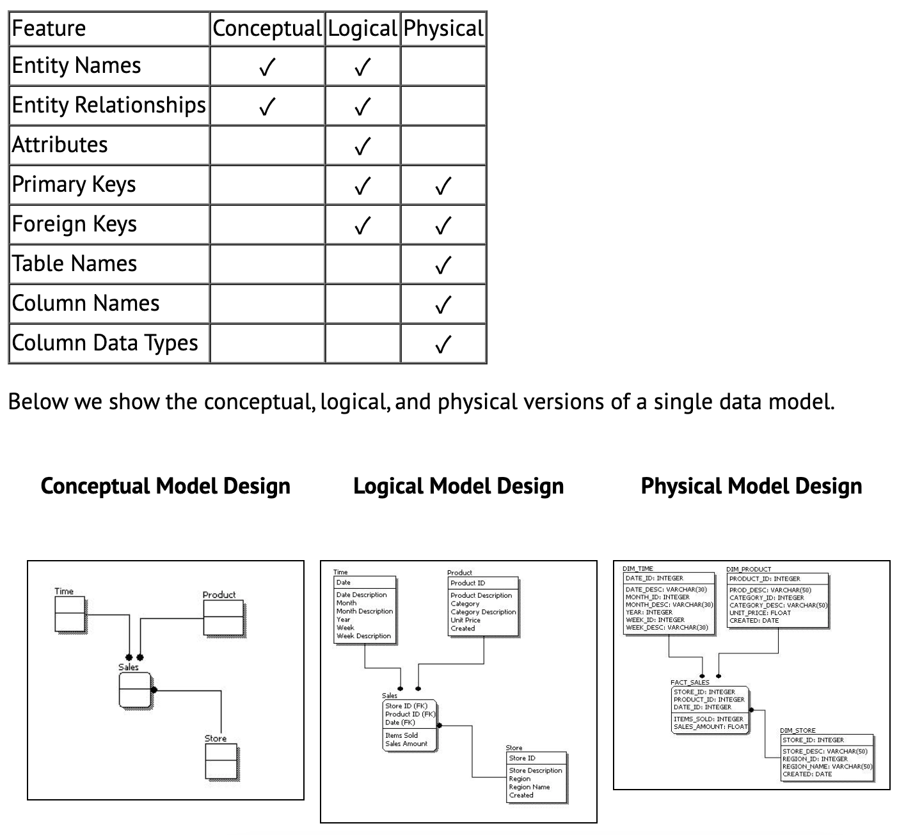
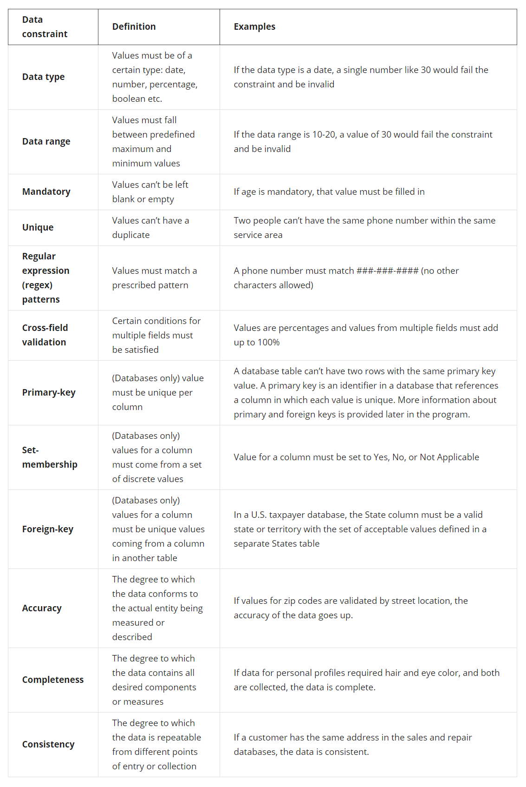
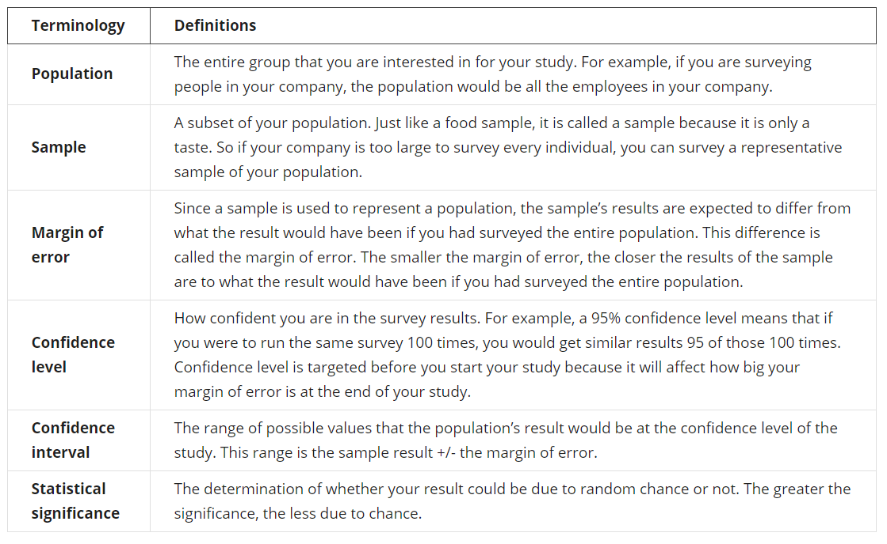
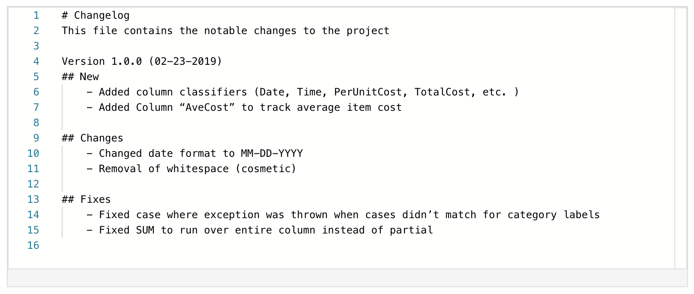
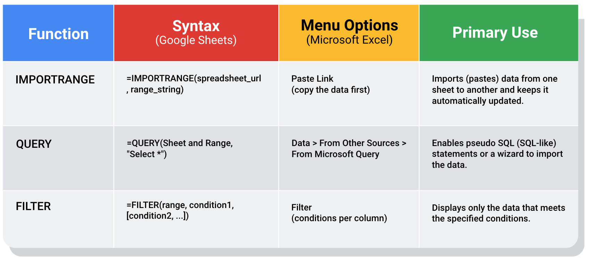

## Thinking analytically

**Data ecosystems**: made up of various elements that interact with one another in order to produce, manage, store, organize, analyze, and share data.

### **Data analysis phases:**

1.  **Ask** questions and define the problem

    -   Define the problem you're trying to solve
    -   Make sure you fully understand the **stakeholder's expectations**
    -   Focus on the actual problem and avoid any distractions
    -   Collaborate with stakeholders and keep an open line of communication
    -   Take a step back and see the whole situation in **context**
    -   What are my stakeholders saying their problems are?
    -   Now that I've identified the issues, how can I help the stakeholders resolve their questions?

2.  **Prepare** data by collecting and storing the information

    -   What **metrics** to measure
    -   **Locate** data in your database
    -   Create **security** measures to protect that data
    -   What do I need to figure out how to solve this problem?
    -   What research do I need to do?

3.  **Process** data by cleaning and checking the information

    -   Using spreadsheet functions to find **incorrectly** entered data
    -   Using SQL functions to check for extra spaces
    -   Removing **repeated** entries
    -   Determining if your data is biased
    -   What **data errors** or **inaccuracies** might get in my way of getting the best possible answer to the problem I am trying to solve?
    -   How can I clean my data so the information I have is more consistent?

4.  **Analyze** data to find patterns, relationships, and trends

    -   Perform calculations
    -   Combine data from multiple sources
    -   Create tables with your results
    -   What story is my data telling me?
    -   How will my data help me solve this problem?
    -   Who needs my company's product or service? What type of person is most likely to use it?

5.  **Share** data with your audience

    -   Make better decisions
    -   Make more informed decisions
    -   Lead to stronger outcomes
    -   Successfully communicate your findings
    -   How can I make what I present to the stakeholders engaging and easy to understand?
    -   What would help me understand this if I were the listener?

6.  **Act** on the data and use the analysis results.

    -   How can I use the feedback I received during the share phase (step 5) to actually meet the shareholder's needs and expectations?

#### Structured thinking

These six steps can help you to break the data analysis process into smaller, manageable parts, which is called **structured thinking**. This process involves four basic activities:

1.  Recognizing the current problem or situation
2.  Organizing available information
3.  Revealing gaps and opportunities
4.  Identifying your options

To get the most out of **data-driven decision-making**, it's important to include insights from people who are familiar with the business problem. These people are called **subject matter experts**, and they have the ability to look at the results of data analysis and identify any inconsistencies, make sense of gray areas, and eventually validate choices being made.



### **Analytical thinking**

involves identifying and defining a problem and then solving it by using data in an organized, step-by-step manner.

Five key skills in analytical thinking:

1.  **Curiosity** - a desire to know more about something, asking the right questions

2.  **Understanding context** - understanding where information fits into the "big picture"

3.  **Having a technical mindset** - breaking big things into smaller steps

4.  **Data design** - thinking about how to organize data and information

5.  **Data strategy** - thinking about the people, processes, and tools used in data analysis

The five key aspects to analytical thinking:

-   visualization
-   strategy
-   problem-orientation
-   correlation
-   big-picture and detail-oriented thinking

**Root cause**: Ask **Five Whys** to reveal the root cause

**Gap analysis**: lets you examine and evaluate how a process works currently in order to get where you want to be in the future. The general approach to gap analysis is understanding where you are now compared to where you want to be.

### **Data life cycle:**

-   **Plan** - What plans and decisions do you need to make? What data do you need to answer your question?
-   **Capture** - Where does your data come from? How will you get it?
-   **Manage** - How will you store your data? What should it be used for, and how do you keep this data secure and protected?
-   **Analyze** - How will the company analyze the data? What tools should they use?
-   **Archive** - What should they do with their data when it gets old? How do they know when it's time?
-   **Destroy** - Should they ever dispose of any data? If so, when and how?

The type of questions you ask as you begin this "deep dive" are very important. Some common questions are:

-   **Objectives**: What are the goals of this deep dive? What, if any, questions are expected to be answered?

-   **Audience**: Who are the stakeholders? Who is interested or concerned about the results of this deep dive? Who will you be presenting to?

-   **Time**: What is the time frame for completion? By what date does this need to be done?

-   **Resources**: What resources are available to accomplish the deep dive's goals?

-   **Security**: Who should have access to the information?

## Asking questions

### SMART questions

-   **Specific**: Questions are simple, significant, and focused on a single topic or a few closely related ideas.

-   **Measurable**: Questions can be quantified and assessed.

-   **Action-oriented**: Questions encourage change.

-   **Relevant**: Questions matter, are important, and have significance to the problem you're trying to solve.

-   **Time-bound**: Questions specify the time to be studied.


### Things to avoid when asking questions

Questions should be **open-ended.** This is the best way to get responses that will help you accurately qualify or disqualify potential solutions to your specific problem.

Now, here are some types of questions that you should try to avoid as a data analyst:

**Leading questions**: questions that only have a particular response

-   Example: *"This product is too expensive, isn't it?"*

**Closed-ended questions**: questions that ask for a one-word or brief response only

-   Example: *"How was the customer trial?"*

**Vague questions:** questions that aren't specific or don't provide context

-   Example: *"Does that tool work for you?"*

A better question might be, "When it comes to data entry, how much time does the tool save you?" This question gives context (data entry) and helps frame responses that are measurable (time).

#### **When Creating questions**

-   Avoid technical jargon.
-   Prioritize your questions: Ask the most important and impactful questions first to save time.
-   Make your time count: Stay on subject during the conversation.
-   Clarify your understanding: To avoid confusion, briefly summarizing the given answers to make sure you understood it correctly. This will go a long way in helping you avoid mistakes.

#### Take good notes

-   **Facts**: Any concrete piece of information is usually worth writing down. Dates, times, names, and other specifics that pop up.
-   **Context**: Facts without context are useless. Note any relevant details that are needed in order to understand the information you gather.
-   **Unknowns**: Sometimes you may miss an important question during a conversation. Make a note when this happens so you know to figure out the answer later.

For example, if we had a conversation with an ice cream shop about collecting data on customer flavor preferences, our notes might appear something like this:

-   **Project**: Collect customer flavor preference data.
-   Overall **business goal**: Use data to create more popular flavors.
-   Two **data sources**: Cash register receipts and completed customer surveys (email).
-   Target **completion date**: Q2
-   **To do**: Call back later and speak with the manager about the location of survey data.

### Problem Types

Data analysts typically work with six problem types:

1.  Making predictions
2.  Categorizing things
3.  Spotting something unusual
4.  Identifying themes
5.  Discovering connections
6.  Finding patterns

### Types of dashboards

1.  **Strategic**: Focuses on long term goals and strategies at the highest level of metrics
2.  **Operational**: Short-term performance tracking and intermediate goals
3.  **Analytical**: Consists of the datasets and the mathematics used in these sets

#### Data cycle for spreadsheets

-   **Plan** for the users who will work within a spreadsheet by developing organizational standards. This can mean formatting your cells, the headings you choose to highlight, the color scheme, and the way you order your data points. When you take the time to set these standards, you will improve communication, ensure consistency, and help people be more efficient with their time.

-   **Capture** data by the source by connecting spreadsheets to other data sources, such as an online survey application or a database. This data will automatically be updated in the spreadsheet. That way, the information is always as current and accurate as possible.

-   **Manage** different kinds of data with a spreadsheet. This can involve storing, organizing, filtering, and updating information. Spreadsheets also let you decide who can access the data, how the information is shared, and how to keep your data safe and secure.

-   **Analyze** data in a spreadsheet to help make better decisions. Some of the most common spreadsheet analysis tools include formulas to aggregate data or create reports, and pivot tables for clear, easy to understand visuals.

-   **Archive** any spreadsheet that you don't use often, but might need to reference later with built-in tools. This is especially useful if you want to store historical data before it gets updated.

-   **Destroy** your spreadsheet when you are certain that you will never need it again, if you have better backup copies, or for legal or security reasons. Keep in mind, lots of businesses are required to follow certain rules or have measures in place to make sure data is destroyed properly.

### Working with stakeholders

**Stakeholders** are people who have invested time, interest, and resources into the projects that you are working on.

There are three common stakeholder groups that you might find yourself working with: the executive team, the customer-facing team, and the data science team.


#### Lead great meetings

1.  **Before the meeting**

If you are organizing the meeting, you will probably talk about the data. Before the meeting:

-   **Identify your objective**. Establish the purpose, goals, and desired outcomes of the meeting, including any questions or requests that need to be addressed.

-   Acknowledge participants and keep them involved with different points of view and experiences with the data, the project, or the business.

-   Organize the data to be presented. You might need to turn raw data into accessible formats or create data visualizations.

-   Prepare and distribute an agenda. We will go over this next.

2.  **Crafting a compelling agenda**

Here are the basic parts your agenda should include:

-   Meeting start and end time
-   Meeting location (including information to participate remotely, if that option is available)
-   Objectives
-   Background material or data the participants should review beforehand

3.  **Sharing your agenda ahead of time**

After writing your agenda, it's time to share it with the invitees. Sharing the agenda with everyone ahead of time helps them understand the meeting goals and prepare questions, comments, or feedback.

4.  **During the meeting**

As the leader of the meeting, it's your job to guide the data discussion. With everyone well informed of the meeting plan and goals, you can follow these steps to avoid any distractions:

-   Make introductions (if necessary) and review key messages
-   Present the data
-   Discuss observations, interpretations, and implications of the data
-   Take notes during the meeting
-   Determine and summarize next steps for the group

5.  **After the meeting**

To keep the project and everyone aligned, prepare and distribute a brief recap of the meeting with next steps that were agreed upon in the meeting. You can even take it a step further by asking for feedback from the team.

-   Distribute any notes or data
-   Confirm next steps and timeline for additional actions
-   Ask for feedback (this is an effective way to figure out if you missed anything in your recap)

## Preparing data

### Data formats

-   Primary vs.Secondary
-   Internal vs.External
-   Continuous vs.Discrete
-   Qualitative vs.Quantitative
-   Nominal vs.Ordinal
-   Structured vs.Unstructured


### **Data modeling**

Data modeling is the process of creating diagrams that visually represent how data is organized and structured. These visual representations are called data models. You can think of data modeling as a blueprint of a house.

#### **Levels of data modeling**

1.  **Conceptual** data modeling gives you a high-level view of your data structure, such as how you want data to interact across an organization
2.  **Logical** data modeling focuses on the technical details of the model such as relationships, attributes, and entities.
3.  **Physical** data modeling should actually depict how the database was built. By this stage, you are laying out how each database will be put in place and how the databases, applications, and features will interact in specific detail.



Reference: <https://www.1keydata.com/datawarehousing/data-modeling-levels.html>

**Basic data modeling techniques**

-   ER Diagrams
-   UML Class Diagrams
-   a Data Dictionary

1.  **Entity-Relationship modeling** is a default technique for modeling and the design of relational (traditional) databases.

**ERDs** work well if you want to design a relational (classic) database, Excel databases or CSV files. Basically, any kind of tabular data. They work well for visualization of database schemas and communication of top-level view of data.


2.  **UML (Unified Modeling Language)** is a standardized family of notations for modeling and design of information systems.

You can use class diagrams to design a tabular data (such as in RDBMS), but were designed and are used mostly for object-oriented programs (such as Java or C\#).


3.  **Data dictionaries** are a tabular definition/representation of data assets. Data dictionary is an inventory of data sets/tables with the list of their attributes/columns.

Data dictionary is suitable as detailed specification of data assets and can be supplemented with ER diagrams, as both serve slightly different purpose.


Reference: <https://dataedo.com/blog/basic-data-modeling-techniques>

### Data bias

-   **Observer** bias
    -   sometimes referred to as experimenter bias or research bias
    -   the tendency for different people to observe things differently

-   **Interpretation** bias
    -   the tendency to always interpret ambiguous situations in a positive, or negative way

-   **Confirmation** bias
    -   the tendency to search for, or interpret information in a way that confirms preexisting beliefs

### Good data

Who created the data set? Is it part of a credible organization?When was the data last refreshed? If you have original data from a reliable organization and it's comprehensive, current, and cited, it **ROCCC**s!

-   **Reliable** data from a reliable organization
-   Original
-   Comprehensive
-   Current
-   Cited

### Data ethics

Ethics refers to well-founded **standards of right and wrong** that prescribe what humans ought to do, usually in terms of rights, obligations, benefits to society, fairness, or specific virtues.

#### Aspects of data ethics

-   **Ownership**
    -   It's individuals who own the raw data they provide, and they have primary control over its usage, how it's processed, and how it's shared.

-   **Transaction transparency**
    -   all data processing activities and algorithms should be completely explainable and understood by the individual who provides their data in response to concerns over data bias

-   **Consent**
    -   an individual's right to know explicit details about how and why their data will be used before agreeing to provide it

-   **Currency**
    -   Individuals should be aware of financial transactions resulting from the use of their personal data and the scale of these transactions

-   **Privacy**

-   **Openness**

#### Data privacy

Privacy means preserving a data subject's information and activity any time a data transaction occurs.

-   protection from unauthorized access to our private data
-   freedom from inappropriate use of our data
-   the right to inspect, update, or correct our data
-   ability to give consent to use our data
-   legal right to access our data

**Here is a list of data that is often anonymized:**

-   Telephone numbers
-   Names
-   License plates and license numbers
-   Social security numbers
-   IP addresses
-   Medical records
-   Email addresses
-   Photographs
-   Account numbers

#### Open data

In data analytics, **open data** is part of **data ethics,** which has to do with using data ethically. **Openness** refers to free access, usage, and sharing of data. But for data to be considered open, it has to be:

-   Available and accessible to the public as a complete dataset
-   Provided under terms that allow it to be reused and redistributed
-   Allows **universal participation** so that anyone can use, reuse, and redistribute the data

**PII and licensing, third party data, and privacy**

- **Second party data** is data that's collected by a group directly from its audience and then sold. Third party data doesn't come from inside your own business

- **Third party data** is collected by an entity that doesn't have a direct relationship with the data. For example, third parties might collect information about visitors to a certain website. Doing this lets these third parties create "audience profiles," which helps them better understand user behavior, and target them with more effective advertising.

- **Personal Identifiable Information (PII)** is data that is reasonably likely to identify a person and make information known about them. We all want to keep this type of information about ourselves private. So it is important to find a balance between privacy and openness in public data.


## Databases

A **normalized** database is a database in which only related data is stored in each table. The main idea behind **database normalization** is that a table should be about a specific topic and only include supporting related data.

### Database structures using schemas

Relational databases can also be organized in different ways according to schemas. A **schema** is a way of describing how something is organized.

Schemas are useful when you are learning about a new data set or designing a relational database. A **database schema** represents any kind of structure that we apply to the database. At the most basic level, a database schema tells us which tables or relations make up the database, plus the fields included in each table.

Two commonly used schemas are star schemas and snowflake schemas.

-   **星型模型 Star schema:** A **star schema** is a schema with one or more fact tables referencing any number of dimension tables. As its name suggests, this schema is shaped like a star. You can also imagine the fact table as the sun at the center of a solar system, with the dimension tables as the planets orbiting the sun. By design, star schemas let data analysts **process data and get results from a database quickly**. This type of schema is best for high-scale information delivery because it makes read output more efficient.

-   **雪花模型 Snowflake schema:** A **snowflake schema** is an extension of a star schema with more dimensions and even sub-dimensions, too. These dimensions and sub-dimensions create a snowflake pattern. Like real snowflakes, a snowflake schema---and the relationships within it---can be complex. Snowflake schemas are an organization type **designed for lightning-fast data processing**.

### Metadata

Metadata creates a single source of truth by keeping things consistent and uniform. Metadata also makes data more reliable by making sure it's accurate, precise, relevant, and timely.

-   **Descriptive**

    -   Metadata that describes a piece of data and can be used to identify it at a later point in time
    -   For instance, the descriptive metadata of a book in a library would include the ISBN, author and title.

-   **Structural**

    -   Metadata that indicates how a piece of data is organized and whether it's part of one or more than one data collection. It also keeps track of the relationship between two things.

    -   For instance, how the pages of a book are put together to create different chapters

-   **Administrative**

    -   Metadata that indicates the technical source of a digital asset

    -   When we looked at the metadata inside the photo, that was administrative metadata.

#### Managing metadata

A **metadata repository** is a database specifically created to store metadata. Metadata repositories can be stored in a physical location, or they can be virtual, like data that exists in the cloud.

These repositories describe where metadata came from, keep it in an accessible form so it can be used quickly and easily, and keep it in a common structure for everyone who may need to use it.

-   First, metadata includes information about where each system is located and where the data sets are located within those systems.
-   Second, the metadata describes how all of the data is connected between the various systems.

Another important aspect of metadata is **data governance**.

**Data governance** is a process to ensure the formal management of a company's data assets. This gives an organization better control of their data and helps a company manage issues related to data security and privacy, integrity, usability, and internal and external data flows.

### Accessing different data sources

If you are connecting to and performing SQL queries on other database platforms, here are similar getting started resources:

-   MySQL: <https://dev.mysql.com/doc/mysql-getting-started/en/>
-   Microsoft SQL Server: <https://docs.microsoft.com/en-us/sql/relational-databases/tutorial-getting-started-with-the-database-engine?view=sql-server-ver15>
-   PostgreSQL: <https://www.postgresql.org/docs/10/tutorial-start.html>
-   SQLite: <https://www.sqlite.org/quickstart.html>

### Organizing data

#### Naming conventions

When creating a file structure and naming convention pattern for a project, you should always:

-   Work out your conventions early in your project.
-   Align file naming conventions with your team.
-   Make sure filenames are meaningful.
-   Keep file names short and to the point.

| Formatting Convention | Example Format |
| --- | --- |
| Dates as 'yyyymmdd' | SalesReport20201125|
| Lead revision numbers with 0 | SalesReport20201125v02 |
| Use hyphens, underscores, or capitalized letters | SalesReport_2020_11_25_v02 |

### Securing data

- **Encryption** uses a unique algorithm to alter data and make it unusable by users and applications that don't know the algorithm. This algorithm is saved as a "key" which can be used to reverse the encryption; so if you have the key, you can still use the data in its original form.

- **Tokenization** replaces the data elements you want to protect with randomly generated data referred to as a "token." The original data is stored in a separate location and mapped to the tokens. To access the complete original data, the user or application needs to have permission to use the tokenized data and the token mapping. This means that even if the tokenized data is hacked, the original data is still safe and secure in a separate location.

There are a lot of others, like using authentication devices for AI technology.

## Process data

### Data integrity

- **Data replication** is the process of storing data in multiple locations. If you're replicating data at different times in different places, there's a chance your data will be out of sync.

- **Data transfer** is the process of copying data from a storage device to memory, or from one computer to another. If your data transfer is interrupted, you might end up with an incomplete data set, which might not be useful for your needs.

- **Data manipulation** process involves changing the data to make it more organized and easier to read. Data manipulation is meant to make the data analysis process more efficient, but an error during the process can compromise the efficiency.

Data can also be compromised through *human error, viruses, malware, hacking, and system failures*, which can all lead to even more headaches.

#### Data constraints


#### Well-aligned objectives and data
Data being used for analysis should align with **business objectives** and help answer stakeholder questions.

- When there is clean data and good alignment, you can make accurate insights and conclusions.
- If there is good alignment but the data needs to be cleaned, clean the data before you perform your analysis. 
- If the data only partially aligns with an objective, think about how you could modify the objective, or use data constraints to make sure that the subset of data better aligns with the business objective.

#### Deal with data issues

**Types of insufficient data**

- data from only one source
- data that keeps updating
- outdated data
- geographically-limited data

**Ways to address insufficient data**

- Identify trends with the available data
- Wait for more data if time allows
- Talk with stakeholders and adjust your objective
- Look for a new dataset

**Data issues**
- no data
    - Gather the data on a small scale to perform a preliminary analysis and then request additional time to complete the analysis after you have collected more data
    - If there isn’t time to collect data, perform the analysis using proxy data from other datasets. *This is the most common workaround.*
    
- too little data
    - Do the analysis using proxy data along with actual data
    - Adjust your analysis to align with the data you already have

- wrong data
    - Identify errors in the data and, if possible, correct them at the source by looking for a pattern in the errors
    - Go ahead with the analysis if your sample size is still large enough and ignoring the data won’t cause systematic bias
    - Data errors


#### Sampling


**Determining the size of your sample**
- Don’t use a sample size less than 30. It has been statistically proven that 30 is the smallest sample size where an average result of a sample starts to represent the average result of a population

- As sample size increases, the average result of the sample grows closer to the average result of the population

- The confidence level most commonly used is 95%, but 90% can work in some cases

Increase the sample size to meet specific needs of your project:

- For a higher confidence level, use a larger sample size
- To decrease the margin of error, use a larger sample size
- For greater statistical significance, use a larger sample size

Also:
- Sample sizes vary by business problem
- Larger sample sizes have a higher cost
- Knowing the basics is helpful

Sample Size Calculator: https://www.coursera.org/learn/process-data/supplement/ZqcDw/sample-size-calculator

**Margin of error**

A/B testing (or split testing) tests two variations of the same web page to determine which page is more successful in attracting user traffic and generating revenue. User traffic that gets monetized is known as the conversion rate. A/B testing allows marketers to test emails, ads, and landing pages to find the data behind what is working and what isn’t working. Marketers use the confidence interval (made up of the conversion rate and the margin of error) to understand the results.

Calculator: https://goodcalculators.com/margin-of-error-calculator/


### Clean data
**Data engineers** transform data into a useful format for analysis and give it a reliable infrastructure. This means they develop, maintain, and test databases, data processors and related systems.

**Data warehousing specialists** develop processes and procedures to effectively store and organize data. They make sure that data is available, secure, and backed up to prevent loss.

#### Types of dirty data
- **Duplicate data**
    - description: any data record that shows up more than once
    - possible causes: manual data entry, batch data imports, or data migration
    - potential harm: skewed metrics or analyses, inflated or inaccurate counts or predictions, or confusion during data retrieval

- **Outdated data**
    - description: any data that has been superseded by newer and more accurate information
    - possible causes: people changing roles or companies, or software and systems becoming obsolete
    - potential harm: inaccurate insights, decision-making, and analytics

- **Incomplete data**
    - description: any data that is missing important fields
    - possible causes: improper data collection or incorrect data entry
    - potential harm: decreased productivity, inaccurate insights, or inability to complete essential services

- **Incorrect/inaccurate data**
    - description: any data that is complete but inaccurate
    - possible causes: human error inserted during data input, fake information, or mock data
    - potential harm: inaccurate insights or decision-making based on bad information resulting in revenue loss

- **Inconsistent data**
    - description: any data that uses different formats to represent the same thing
    - possible causes: data stored incorrectly or errors inserted during data transfer
    - potential harm: contradictory data points leading to confusion or inability to classify or segment customers

**Data validation** is a tool for checking the accuracy and quality of data before adding or importing it.

#### Common mistakes
- Not checking for spelling errors
- Forgetting to document errors
- Not checking for misfielded values: A misfielded value happens when the values are entered into the wrong field
- Overlooking missing values
- Only looking at a subset of the data
- Losing track of business objectives
- Not fixing the source of the error
- Not analyzing the system prior to data cleaning
- Not backing up your data prior to data cleansing
- Not accounting for data cleaning in your deadlines/process

#### Data merging
Compatibility: how well two or more datasets are able to work together.

#### Data mapping
is the process of matching fields from one database to another. This is very important to the success of data migration, data integration, and lots of other data management activities.

Depending on the schema and number of primary and foreign keys in a data source, data mapping can be simple or very complex.

- Identify what data needs to be moved
- Transforming data into a consistent format
- Transfer data to its destination
- Inspect a sample piece of data to confirm


#### Automating data cleaning
- Towards Data Science’s [Automating Scientific Data Analysis](https://towardsdatascience.com/automating-scientific-data-analysis-part-1-c9979cd0817e)
- MIT News’ [Automating Big-Data Analysis](https://news.mit.edu/2016/automating-big-data-analysis-1021)
- TechnologyAdvice’s [10 of the Best Options for Workflow Automation Software](https://technologyadvice.com/blog/information-technology/top-10-workflow-automation-software/)


### Cleaning using SQL

#### SQL Dialects
- The SQL Standard is an official ANSI/ISO document that defines the syntax of SQL. No database is fully compatible with the standard.
- Transact-SQL, or **T-SQL**, is the name of the variant of SQL used in the Microsoft SQL Server database.
- **PL/SQL** is the procedural extension to SQL in the Oracle database. It is used to write your own functions and procedures in Oracle.
- **PL/pgSQL** is the procedural extension to SQL in the PostgreSQL database. It is used to write your own functions and procedures in PostgreSQL.

https://learnsql.com/blog/what-sql-dialect-to-learn/

SQL Server, PostgreSQL, MySQL... what's the difference? Where do I start? https://www.datacamp.com/community/blog/sql-differences

#### Functions
- Getting data from a table using **SELECT** statements
- De-duplicating data using commands like **DISTINCT** and **COUNT + WHERE**
- Manipulating string data with **TRIM()**, **SUBSTR**, and **LENGTH**
- Creating/Dropping Tables with **CREATE TABLE** and **DROP TABLE**
- Changing data types with **CAST**
    - CAST(field AS datatype)
- CONCAT()
- COALESCE(column1, column2) AS new_column: return non-null values
- CASE WHEN

### Verifying and reporting
**Verification** is a process to confirm that a data cleaning effort was well- executed and the resulting data is accurate and reliable. It also involves manually cleaning data to compare your expectations with what's actually present.

1. Go back to your original unclean data set and comparing it to what you have now.
    - Sources of errors
    - Null data
    - Misspelled words
    - Mistyped numbers
    - Extra spaces and characters
    - Duplicates
    - Mismatched data types
    - Messy (inconsistent) strings
    - Messy (inconsistent) date formats
    - Misleading variable labels (columns)
    - Truncated data
    - Business Logic: Did you check that the data makes sense given your knowledge of the business?

2. Take a big-picture view of your project:
    - consider the business problem you're trying to solve with the data
    - consider the goal of the project
    - consider whether your data is capable of solving the problem and meeting the project objectives

Ask a teammate to review your data from a fresh perspective and getting feedback from others.

3. Manually fix errors.

#### Documenting cleaning results
- recover data-cleaning errors
- inform others of changes you've made
- determine the quality of data to be used in analysis

A **changelog** is a file containing a chronologically ordered list of modifications made to a project.

- Changelogs are for humans, not machines, so write legibly
- Every version should have its own entry

- Group the same types of changes. For example：
    - *Added*: new features introduced
    - *Changed*: changes in existing functionality
    - *Deprecated*: features about to be removed
    - *Removed*: features that have been removed
    - *Fixed*: bug fixes
    - *Security*: lowering vulnerabilities
    
- Each change gets its own line
- Versions should be ordered chronologically starting with the latest
- Release date of each version should be noted

Typically, a **changelog** records this type of information:

- Data, file, formula, query, or any other component that changed
- Description of what changed
- Date of the change
- Person who made the change
- Person who approved the change
- Version number
- Reason for the change

It is common to keep changelogs as a readme file in a code repository.



Here is how a **version control system** affects a change to a query:

1. A company has official versions of important queries in their **version control system**.
2. An analyst makes sure the most up-to-date version of the query is the one they will change. This is called **syncing**.
3. The analyst makes a change to the query.
4. The analyst might ask someone to review this change. This is called a **code review** and can be informally or formally done. An informal review could be as simple as asking a senior analyst to take a look at the change.
5. After a reviewer approves the change, the analyst submits the updated version of the query to a repository in the company's version control system. This is called a **code commit**. A best practice is to document exactly what the change was and why it was made in a comments area. Going back to our example of a query that pulls daily revenue, a comment might be: Updated revenue to include revenue coming from the new product, Calypso.
6. After the change is **submitted**, everyone else in the company will be able to access and use this new query when they **sync** to the most up-to-date queries stored in the version control system.
7. If the query has a problem or business needs change, the analyst can **undo** the change to the query using the version control system. The analyst can look at a chronological list of all changes made to the query and who made each change. Then, after finding their own change, the analyst can **revert** back to the previous version.
8. The query is back to what it was before the analyst made the change. And everyone at the company sees this reverted, original query, too.

Common data errors:
- Human error in data entry
- Flawed processes
- System issues



## Analyze Data
4 phases of analysis:
- organize data
- format and adjust data
- get input from others
- transform data by observing relationships between data points and making calculations

Database organization enables analysts to make decisions about which data is relevant to pull for a specific analysis. It also helps them decide which data types and variables are appropriate.

### Organize data
- **Sorting** involves arranging data into a meaningful order to make it easier to understand, analyze, and visualize.

- **Filtering** is used when you are only interested in seeing data that meets a specific criteria, and hiding the rest.

### Formatting and adjusting data
Data validation in spreadsheets:

- Add dropdown lists with predetermined options
- Create custom checkboxes
- Protect structured data and formulas

#### Transforming data in SQL:
- **CAST()**
    - converting a number to a string, `SELECT CAST(MyCount AS STRING) FROM MyTable`
    - converting a string to a number, `SELECT CAST(MyCharCol AS INT) FROM MyTable`
    - converting a date to a datetime, `SELECT CAST(MyDate AS DATETIME) FROM MyTable`

- **SAFT_CAST()**, to avoid errors in the event of a failed query, use the SAFE_CAST function instead. The SAFE_CAST function returns a value of Null instead of an error when a query fails.

Reference:
- MySQL Cast functions and operators: https://dev.mysql.com/doc/refman/8.0/en/cast-functions.html

- SQL Server, Azure CAST and CONVERT: https://docs.microsoft.com/en-us/sql/t-sql/functions/cast-and-convert-transact-sql?view=sql-server-ver15

- SQL type casting (Amazon Redshift, PostgreSQL, Google BigQuery or SQL Server): https://www.blendo.co/blog/how-to-sql-type-casting/

#### Merging multiple data
**CONCAT()** adds strings together to create new text strings that can be used as unique keys, `SELECT CONCAT ('Data', '  ', 'analysis')`

### Aggregating data for analysis
**VLOOKUP**:

- *TRUE* means approximate match, *FALSE* means exact match.
- You want your VLOOKUP column to be on the left hand side of your data. The VLOOKUP only looks at data to the right.
- Once you’ve populated data with the VLOOKUP formula, copy and paste as values before you start to manipulate the data.

#### SQL **JOIN** types
- *Cross Joins* would result in a table with all possible combinations of your tables’ rows together
    - `SELECT * FROM facebook CROSS JOIN linkedin`
- *Inner Joins* return rows when the join condition is met
    - `FROM table1 INNER JOIN table2 ON table1.column1 = table2.column2`
- *Outer Joins* return all the rows from one table, and if the join condition is met, columns from the other
    - LEFT JOIN
    - RIGHT JOIN
    - FULL JOIN


Reference:

- https://dataschool.com/how-to-teach-people-sql/sql-join-types-explained-visually/
- https://www.dofactory.com/sql/union


#### COUNT and COUNT DISTINCT
#### Subqueries
- Subqueries must be enclosed within parentheses
- A subquery can have only one column in the SELECT clause unless multiple columns are in the main query for the subquery to compare its selected columns
- Subqueries that return more than one row can only be used with multiple value operators, such as the IN operator
- A subquery can’t be immediately enclosed in a set function


*Using subqueries to aggregate in multiple stages:*

```SQL
SELECT LEFT(sub.date, 2) AS cleaned_month,
       sub.day_of_week,
       AVG(sub.incidents) AS average_incidents
  FROM (
        SELECT day_of_week,
               date,
               COUNT(incidnt_num) AS incidents
          FROM tutorial.sf_crime_incidents_2014_01
         GROUP BY 1,2
       ) sub
 GROUP BY 1,2
 ORDER BY 1,2
```

*Subqueries in conditional logic:*

```SQL
SELECT *
  FROM tutorial.sf_crime_incidents_2014_01
 WHERE Date = (SELECT MIN(date)
                 FROM tutorial.sf_crime_incidents_2014_01
              )

# IN is the only type of conditional logic that will work when the inner query contains multiple results

SELECT *
  FROM tutorial.sf_crime_incidents_2014_01
 WHERE Date IN (SELECT date
                 FROM tutorial.sf_crime_incidents_2014_01
                ORDER BY date
                LIMIT 5
              )
# Note that you should not include an alias when you write a subquery in a conditional statement. This is because the subquery is treated as an individual value (or set of values in the IN case) rather than as a table.
```

*Join subqueries:*
```SQL
SELECT *
  FROM tutorial.sf_crime_incidents_2014_01 incidents
  JOIN ( SELECT date
           FROM tutorial.sf_crime_incidents_2014_01
          ORDER BY date
          LIMIT 5
       ) sub
    ON incidents.date = sub.date
```
Reference: https://mode.com/sql-tutorial/sql-sub-queries/

### Performing data calculations
- **SUMIF()**: `=SUMIF(range, criterion, sum_range)`
- **SUMIFS()**: `=SUMIFS(sum_range, criteria_range1, criterion1, [criteria_range2, criterion2, ...])`
- **COUNTIF()**: `=COUNTIF(range, criterion)`
- **COUNTIFS()**: `=COUNTIFS(criteria_range1, criterion1, [criteria_range2, criterion2, ...])`
- **SUMPRODUCT()**: it first multiplies arrays and returns the sum of those products, `=SUMPRODUCT(array1, [array2]...)`

#### Types of data validation
The first five are validation types associated with the data *(type, range, constraint, consistency, and structure)* and the sixth type focuses on the validation of application code used to accept data from user input.

**Example**: Data values for elementary school grades should be values between 1 and 12.

1. Data type  
checks that the data matches the data type defined for a field

*Limitations*: The data value 13 would pass the data type validation but would be an unacceptable value. For this case, data range validation is also needed.

2. Data range  
checks that the data falls within an acceptable range of values defined for the field

*Limitations*: The data value 11.5 would be in the data range and would also pass as a numeric data type. But, it would be unacceptable because there aren't half grades. For this case, data constraint validation is also needed.

3. Data constraints  
checks that the data meets certain conditions or criteria for a field. This includes the type of data entered as well as other attributes of the field, such as number of characters

*Limitations*: The data value 13 is a whole number and would pass the content constraint validation. But, it would be unacceptable since 13 isn’t an elementary school grade. For this case, data range validation is also needed.

4. Data consistency  
checks that the data makes sense in the context of other related data

**Example**: Data values for product shipping dates can’t be earlier than product production dates.

*Limitations*: Data might be consistent but still incorrect or inaccurate. A shipping date could be later than a production date and still be wrong.

5. Data structure  
checks that the data follows or conforms to a set structure

**Example**: Web pages must follow a prescribed structure to be displayed properly.

*Limitations*: A data structure might be correct with the data still incorrect or inaccurate. Content on a web page could be displayed properly and still contain the wrong information.

6. Code validation
checks that the application code systematically performs any of the previously mentioned validations during user data input

**Example**: Common problems discovered during code validation include: more than one data type allowed, data range checking not done or ending of text strings not well defined.

*Limitations*: Code validation might not validate all possible variations with data input.

#### SQL temporary tables
Temporary tables in a SQL database that aren’t stored permanently. They are automatically deleted from the database when you end your SQL session.

- can be used as a holding area for storing values if you are making a series of calculations. This is sometimes referred to as **pre-processing** of the data.
- can collect the results of multiple, separate queries. This is sometimes referred to as data **staging**. Staging is useful if you need to perform a query on the collected data or merge the collected data.
- can store a filtered subset of the database. You don’t need to select and filter the data each time you work with it. In addition, using fewer SQL commands helps to keep your data clean.

**Table creation:**

- **SELECT INTO**  
copies data from one table into a new table, but it doesn't add the new table to the database. It's useful if you want to make a copy of a table with a specific condition, like a query with a WHERE clause.

```SQL
SELECT
*
INTO
sales
FROM
Globalsales
WHERE
Region = "Africa"
```

- **WITH**

```SQL
WITH new_data AS (
SELECT *
FROM table
WHERE trip >= 60
)
```

- User-managed **CREATE TABLE**  
does add the table into the database in case everyone needs access to the table. The CREATE TABLE statement is also useful for tables that are more complex.

In most relational database management systems or RDBMSs, you can add metadata to describe the data that's contained in the table you've created.

```SQL
CREATE TABLE table_name (
  colunm1 datatype,
  colunm2 datatype,
  ...
)
```

After you have completed working with your temporary table, you can remove the table from the database using the **DROP TABLE** clause.

#### Best practices when working with temporary tables

- Global vs. local temporary tables

Global temporary tables are made available to all database users and are deleted when all connections that use them have closed. Local temporary tables are made available only to the user whose query or connection established the temporary table. You will most likely be working with local temporary tables. If you have created a local temporary table and are the only person using it, you can drop the temporary table after you are done using it.

- Dropping temporary tables after use

Dropping a temporary table is a little different from deleting a temporary table. Dropping a temporary table not only removes the information contained in the rows of the table, but removes the table variable definitions (columns) themselves.

Deleting a temporary table removes the rows of the table but leaves the table definition and columns ready to be used again. Although local temporary tables are dropped after you end your SQL session, it may not happen immediately.

If a lot of processing is happening in the database, dropping your temporary tables after using them is a good practice to keep the database running smoothly.

## Data Visualization
### Visualizing data
#### Effective data viz
1. **The McCandless Method**

- Information, the data you are working with
- Story, a clear and compelling narrative or concept
- Goal, a specific objective or function for the visual
- Visual form, an effective use of metaphor or visual expression


2. **Kaiser Fung's Junk Charts Trifecta Checkup**

- What is the practical question?
- What does the data say?
- What does the visual say?

**Elements for effective visuals:**

- Clear meaning
- Sophisticated use of contrast
- Refined execution, paying deep attention to detail

#### Pre-attentive attributes: marks and channels
*Pre-attentive attributes* are the elements of a data visualization that people recognize automatically without conscious effort. The essential, basic building blocks that make visuals immediately understandable are called marks and channels.

1. **Marks**

- *position*: where a specific mark is in space in relation to a scale or to other marks

- *size*: how big, small, long, or tall a mark is

- *shape*: whether a specific object is given a shape that communicates something about it

- *color*: what color the mark is

2. **Channels**

*Channels* are visual aspects or variables that represent characteristics of the data. Channels are basically marks that have been used to visualize data. Channels will vary in terms of how effective they are at communicating data based on three elements: 

1. *Accuracy*: are the channels helpful in accurately estimating the values being represented?

2. *Popout*: how easy is it to distinguish certain values from others?

3. *Grouping*: how good is a channel at communicating groups that exist in the data?

#### Design principles
- Choose the right visual
- Optimize the data-ink ratio
- Use orientation effectively
- Color
- Numbers of things

**What to avoid:**

- Cutting off the y-axis
- Misleading use of a dual y-axis
- Artificially limiting the scope of the data
- Problematic choices in how data is binned or grouped
- Using part-to-whole visuals when the totals do not sum up appropriately
- Hiding trends in cumulative charts
- Artificially smoothing trends

**Nine basic principles of design:**

1. **Balance**: The design of a data visualization is balanced when the key visual elements, like color and shape, are distributed evenly.

2. **Emphasis**: Your data visualization should have a focal point, so that your audience knows where to concentrate.

3. **Movement**: Movement can refer to the path the viewer’s eye travels as they look at a data visualization, or literal movement created by animations.

4. **Pattern**: You can use similar shapes and colors to create patterns in your data visualization.

5. **Repetition**: Repeating chart types, shapes, or colors adds to the effectiveness of your visualization.

6. **Proportion**: Proportion is another way that you can demonstrate the importance of certain data.

7. *Rhythm*: This refers to creating a sense of movement or flow in your visualization.

8. *Variety*: Your visualizations should have some variety in the chart types, lines, shapes, colors, and values you use. Variety keeps the audience engaged.

9. *Unity*: This means that your final data visualization should be cohesive.

#### Design thinking and visualizations
**Five phases of the design process:**

- *Empathize*: Thinking about the emotions and needs of the target audience for the data visualization

- *Define*: Figuring out exactly what your audience needs from the data

- *Ideate*: Generating ideas for data visualization

- *Prototype*: Putting visualizations together for testing and feedback

- *Test*: Showing prototype visualizations to people before stakeholders see them

#### Making data viz accessible
- Labeling
- Text alternatives
- Text-based format
- Distinguishing, making the content easier to see
- Simplify

**Highlighting key informations:**

- Headlines that pop
- Subtitles that clarify
- Labels that identify
- Annotations that focus


### Creating data viz with Tableau
#### Tableau viz
- Highlight tables
- Heat maps
- Density maps
- Gantt charts
- Symbol maps
- Filled maps
- Circle views
- Box plots
- Bullet graphs
- Packed bubble charts

Tableau guide: https://help.tableau.com/current/pro/desktop/en-us/datasource_prepare.htm

#### Diverging color palette
displays two ranges of values using **color intensity** to show the magnitude of the number and the actual color to show which range the numbers from.

#### Live vs. static dashboards
- **Static data**

Static data involves providing screenshots or snapshots in presentations or building dashboards using snapshots of data. There are pros and cons to static data.

| PROS | CONS |
|------|------|
|Can tightly control a point-in-time narrative of the data and insight|Insight immediately begins to lose value and continues to do so the longer the data remains in a static state|
|Allows for complex analysis to be explained in-depth to a larger audience|Snapshots can't keep up with the pace of data change|


- **Live data**

Live data means that you can build dashboards, reports, and views connected to automatically updated data. 

| PROS | CONS |
|------|------|
|more dynamic and scalable|Can take engineering resources to keep pipelines live and scalable, which may be outside the scope of some companies' data resource allocation|
|Gives the most up-to-date data to the people who need it at the time when they need it|You can lose control of the narrative, which can cause data chaos (i.e. teams coming to conflicting conclusions based on the same data)|
|Allows for up-to-date curated views into data with the ability to build a scalable “single source of truth” for various use cases|Can potentially cause a lack of trust if the data isn’t handled properly|
|Allows for immediate action to be taken on data that changes frequently|-|
|Alleviates time/resources spent on processes for every analysis|-|


### Crafting data stories
**Data storytelling** is communicating the meaning of a data set with visuals and a narrative that are customized for each particular audience.

#### Data storytelling steps
1. *Engage* your audience: capturing and holding someone's interest and attention

2. Create compelling visuals: show the story of your data

3. Tell the story in an interesting *narrative*:  
A *narrative* has a beginning, a middle, and an end, it should connect the data you've collected to the project objective and clearly explain important insights from your analysis.

#### Evaluate a viz
1. **Setting context:**
- How does the visualization help set the context?
- How does the visualization help clarify the data?
- Do you notice a data visualization best practice?

2. **Analyze variables:**
- How does the visualization perform against the five-second rule?
- How does the visualization help clarify the data?
- Do you notice a data visualization best practice?

3. **Drawing conclusions:**
- How does the visualization help make a point?
- How does the visualization help clarify the data?
- Do you notice a data visualization best practice?


**Spotlighting** is scanning through the data to quickly identify the most important insights.

#### Compleling presentation tips
The narrative you share with your stakeholders needs

- **characters**: people affected by your story, such as your stakeholders, customers, clients, etc. Think about why they care.

- **setting**: how often it's happening, what tasks are involved, and other background information.

- **plot**: sometimes called the conflict, is what creates tension in the current situation. 

- **big reveal**: or resolution, is how the data has shown that you can solve the problem the characters are facing by becoming more competitive, improving a process, inventing a new system, or whatever the ultimate goal of your data project may be.

- **"aha moment"**: when you share your recommendations and explain why you think they'll help your company be successful. 

**Sharing a narrative**: select an appropriate *theme*; add your text, visuals, and an exciting reveal at the end; try *pasting, linking, and embedding* visuals from different sources to see how they behave differently.

### Developing presentations and slideshows
**Presenting with a framework:**

- create logical connections that tie back to the business task
- gives your audience context about your data
- helps you focus on the most important information

**Weaving data into your presentation:**

1. It's helpful for your audience to understand what data was available during data collection. You can also tell them if any new relevant data has come up, or if you discovered that you need different data.

2. Establish the initial *hypothesis*. Your initial hypothesis is a theory you're trying to prove or disprove with data. You want to establish your hypothesis early in the presentation so that your audience has the right context to put it in.

3. Next, you'll want to explain the solution to your business tasks using examples and visualizations.

*The McCandless Method:*

- Introduce the graphic by name
- Answer obvious questions before they're asked
- State the insight of your graphic
- Call out data to support that insight
- Tell your audience why it matters

4. Take a second to self-check and ask yourself, *"Does this data point or chart support the point I want people to walk away with?"* It's a good reminder to think about your audience every time you add data to a presentation.

#### Good data presentation
The good presentation **logically** guides the audience through the data – from the objectives at the beginning all the way to the conclusions at the end.

- Title and date the presentation was last updated
- Flow or table of contents
- Transition slides
- Visual introduction to the data (also used as a repeated theme)
- Animated bullet points
- Annotations on top of visuals
- Logic and progression
- Limitations to the data (caveats), what the data can’t tell you

#### Presentation tips

