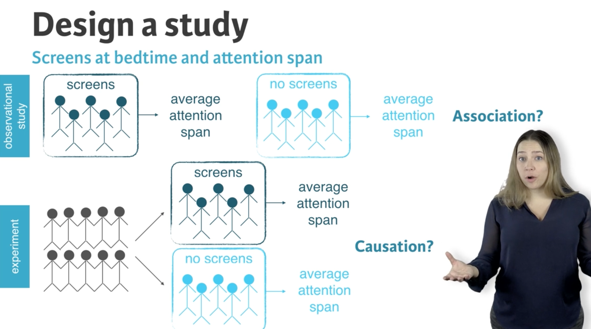
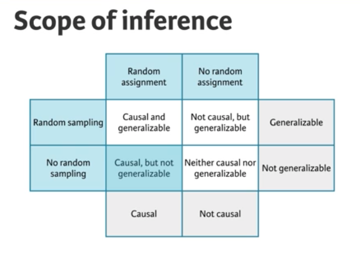

#### Data and variables
查看数据结构
- base包里的`str()`
- dplyr包里的`glimpse()`

- Table to explore: `table(data$column)`  
Filter to subset  
Drop (unused) levels: `droplevels()`

指令
- `ifelse()`  
example:  
x = ifelse(logical test,  
result if TRUE, result if FALSE)

- `case_when()`  
example:  
x = case_when(  
    [condition 1] ~ [value 1],  
    [condition 2] ~ [value 2],  
    [condition 3] ~ [value 3]  
)

- `factor()` 把数值变量因子化

- `(y <- mean(x$z))` 既assign value也打印结果

#### Types of variables
- Numerical (quantitative): numerical values
	- Continuous: infinite number of values within a given range, often measured
	- Discrete: specific set of numeric values that can be counted or enumerated, often counted

- Categorical (qualitative):   
limited number of distinct categories, often stored as factors in R, common in subgroup analysis
	- Ordinal: finite number of values within a given range, often measured

#### Types of studies
- Observational
	- Collect data in a way that does not directly interfere with how the data arise
	- Only correlation can be inferred
- Experimental
	- Randomly assign subjects to various treatments
	- Causation can be inferred

#### Scope of inference
Random sampling & Random assignment

#### Sampling
1. Simple random sample

dplyr - `sample_n(size = 100)`

2. Stratified Sample (stratum)

dplyr -

`group_by()`

`sample_n(size = 100)`

3. Cluster Sample (cluster)
4. Multistage sample

#### Principles of experimental design
- Control: compare treatment of interest to a control group

- Randomize: randomly assign subjects to treatments

- Replicate: collect a sufficiently large sample within a study, or replicate the entire study

- Block: account for the potential effect of confounding variables
	- Group subjects into blocks based on these variables
	- Randomize within each block to treatment groups
