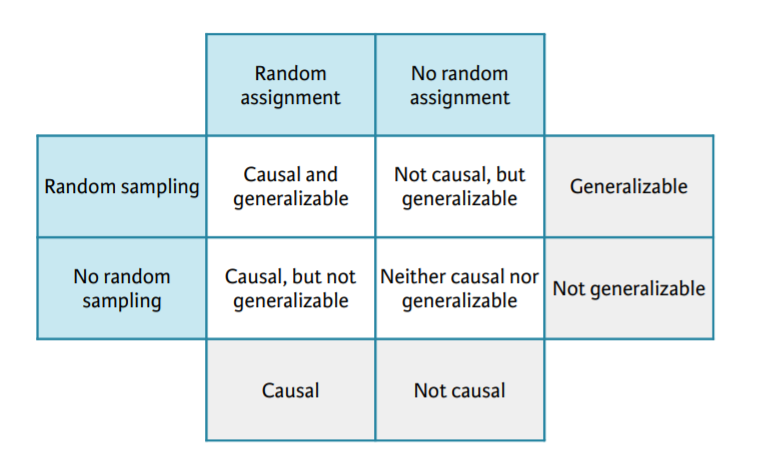

## Introduction to Data in R

#### Data and variables
查看数据结构
- base包里的`str()`
- dplyr包里的`glimpse()`

Dealing with factors 指令
```
# table to explore
table(data)

# Drop (unused) levels
droplevels()

# ifelse()
x = ifelse(logical test,  
result if TRUE, result if FALSE)

# case_when()
x = case_when(  
    [condition 1] ~ [value 1],  
    [condition 2] ~ [value 2],  
    [condition 3] ~ [value 3]  
)

# factor() 把数值变量因子化

# (y <- mean(x$z)) 既assign value也打印结果
```

#### Types of variables
- Numerical (quantitative): numerical values
	- Continuous: infinite number of values within a given range, often measured
	- Discrete: specific set of numeric values that can be counted or enumerated, often counted

- Categorical (qualitative):   
limited number of distinct categories, often stored as factors in R, common in subgroup analysis
	- Ordinal: finite number of values within a given range, often measured

#### Types of studies
- Observational
	- Collect data in a way that does not directly interfere with how the data arise
	- Only correlation can be inferred
- Experimental
	- Randomly assign subjects to various treatments
	- Causation can be inferred


#### Scope of inference 统计推断
- Random sampling
	- At selection of subjects from population
	- Helps generalizability of results

- Random assignment
	- At selection of subjects from population
	- Helps infer causation from results



#### Sampling
1. Simple random sample

dplyr - `sample_n(size = 100)`

2. Stratified Sample (stratum)


```
group_by()
sample_n(size = 100)
```

3. Cluster Sample (cluster)
4. Multistage sample

#### Principles of experimental design
- Control: compare treatment of interest to a control group

- Randomize: randomly assign subjects to treatments

- Replicate: collect a sufficiently large sample within a study, or replicate the entire study

- Block: account for the potential effect of confounding variables
	- Group subjects into blocks based on these variables
	- Randomize within each block to treatment groups

## Exploratory Data Analysis

#### Exploring categorical data
```
> levels(comics$align)
[1] "Bad" "Good" "Neutral"
[4] "Reformed Criminals" 

> table(comics$id, comics$align)

 	Bad Good Neutral Reformed Criminals
 No Dual 474 647 390 0
 Public 2172 2930 965 1
 Secret 4493 2475 959 1
 Unknown 7 0 2 0
 
 # Conditional proportions
 
 # Condition on the rows (i.e. rows sum to 1)
 > prop.table(tab_cnt, 1)

 	Bad Good Neutral
 No Dual 0.314 0.428 0.258
 Public 0.358 0.483 0.159
 Secret 0.567 0.312 0.121
 Unknown 0.778 0.000 0.222

# Condition on the columns (i.e. columns sum to 1)
> prop.table(tab_cnt, 2)

 	Bad Good Neutral
 No Dual 0.066331 0.106907 0.168394
 Public 0.303946 0.484137 0.416667
 Secret 0.628743 0.408956 0.414076
 Unknown 0.000980 0.000000 0.000864
 
 # ggplot2 bar charts
ggplot(comics, aes(x = align, fill = gender)) +
  geom_bar()
  
# Plot proportion
ggplot(comics, aes(x = align, fill = gender)) + 
  geom_bar(position = "fill") +
  ylab("proportion")
```
