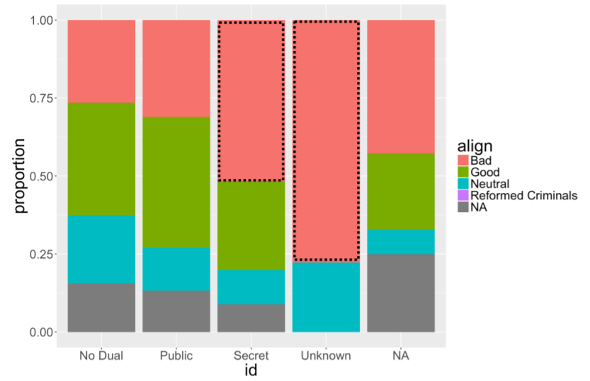
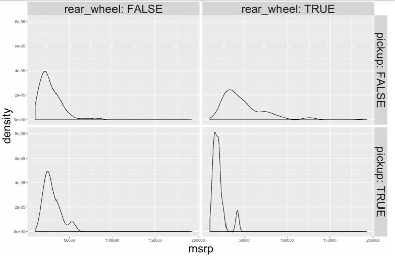

# Exploratory Data Analysis

## Exploring categorical data

一个变量有多少层级

    > levels(comics$align)
    [1] "Bad" "Good" "Neutral"
    [4] "Reformed Criminals" 

*Note: NAs ignored by `levels()` function*

### Counts vs Proportions

Counts:

    > tab_cnt <- table(comics$id, comics$align)
    > tab_cnt
        Bad Good Neutral Reformed Criminals
     No Dual 474 647 390 0
     Public 2172 2930 965 1
     Secret 4493 2475 959 1
     Unknown 7 0 2 0

Conditional proportions:

    # Condition on the rows (i.e. rows sum to 1)
    > prop.table(tab_cnt, 1)

        Bad Good Neutral
     No Dual 0.314 0.428 0.258
     Public 0.358 0.483 0.159
     Secret 0.567 0.312 0.121
     Unknown 0.778 0.000 0.222

    # Condition on the columns (i.e. columns sum to 1)
    > prop.table(tab_cnt, 2)

        Bad Good Neutral
     No Dual 0.066331 0.106907 0.168394
     Public 0.303946 0.484137 0.416667
     Secret 0.628743 0.408956 0.414076
     Unknown 0.000980 0.000000 0.000864

Conditional bar charts:

    # Plot proportion
    ggplot(comics, aes(x = align, fill = gender)) + 
      geom_bar(position = "fill") +
      ylab("proportion")

## Exploring Numerical Data

### Distribution of one variable

Marginal distribution

    tab_cnt <- table(comics$id, comics$align) 

Conditional distribution

    # Faceting
    ggplot(comics, aes(x = id)) +
        geom_bar() +
        facet_wrap(~align)

    # Filtering

    # Dotplot
    ggplot(data, aes(x = weight)) + geom_dotplot(dotsize = 0.4)

    # Histogram (with binwidth)
    ggplot(data, aes(x = weight)) + geom_histogram(binwidth = 3) + facet_wrap(~spam)

    # Density plot (with bandwidth)
    ggplot(data, aes(x = log(exclaim_mess + .01), fill = spam)) + geom_density(bw = 5, alpha = .3)

    # Boxplot
    ggplot(data, aes(x = 1, y = weight)) + geom_boxplot()
    # Side-by-side boxplot
    ggplot(common_cyl, aes(x = as.factor(ncyl), y = city_mpg)) + geom_boxplot() 

### Visualization in higher dimensions

Plots for 3 variables

    ggplot(cars, aes(x = msrp)) +
     geom_density() +
     facet_grid(pickup ~ rear_wheel, labeller = label_both)

Higher dimension plots

-   Shape
-   Size
-   Color
-   Pattern
-   Movement
-   x-coordinate
-   y-coordinate

## Numerical Summaries

### Measures of Center and Variability

**Center**

-   `mean()`
-   `median()`
-   `mode()`

groupwise

    # group_by()
    life %>%
        group_by(continent) %>%
        summarize(mean(expectancy),
        median(expectancy))

**Variability**

-   standard deviation:`sd()`
-   variance:`var()`\
    即 sum((x - mean(x))\^2) / (n -1)
-   interquartile range:`IQR()`\
    即 distance between the two numbers that cut off the middle 50% of your data (the height of box in boxplot)
-   range:`diff(range())`\
    即 max - min

In case of extreme observations, `IQR()` depicts the most accurate spread.

### Shape and transformations

**Modality**

-   Unimodal
-   Bimodal
-   Multimodal
-   Uniform

**Skew**

-   Right-skewed
-   Left-skewed
-   Symmetric

**Plotting without Outliers**

-   用log()减弱outliers的影响

<!-- -->

    ggplot(life, aes(x = income, fill = west_coast)) +
    geom_density(alpha = .3)
    ggplot(life, aes(x = log(income), fill = west_coast)) + geom_density(alpha = .3)

-   直接定义及去掉outliers

<!-- -->

    life <- life %>%
    mutate(is_outlier = income > 75000) 

    life %>%
    filter(!is_outlier) %>%
    ggplot(aes(x = income, fill = west_coast)) +
    geom_density(alpha = .3)

### Zero inflation strategies

1.  Analyze two components separately

There are two mechanisms going on: one generating the zeros, and the other generating the non-zeros.

2.  Collapse into two-level categorical variable

A simpler approach: think of the variable as actually only taking two values, zero or not-zero, and treating it like a categorical variable.
