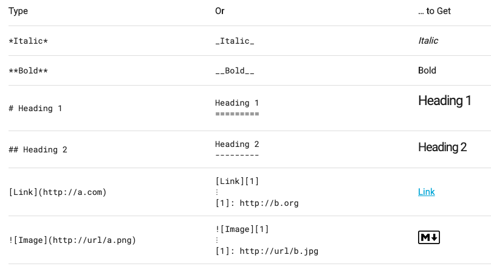

**例1:塑料消费**

.pull-left[

]

.pull-right[

]

---

**例2:二胡の旅**


---
**这种形式呢？**


.small[
音乐相关的视觉呈现：
- [Doodle Chaos](https://www.youtube.com/user/DoodleChaos/videos "Doodle Chaos")，[b站](https://www.bilibili.com/video/av34821558/?p=2)
- [Nicholas Rougeux](https://www.youtube.com/channel/UCRQH9-hWxELNCv47z2O5nfg), [卡农](https://www.youtube.com/watch?v=DxkpN4PUOzA)
]

---
**例3:当代绝症──刷手机**


---

## 作业1中常见问题

- 直接在文档里写了自己的名字、学号、年级专业等隐私信息
- 不会插入图片、链接等
- 以中文字符、符号命名
- 前后命名方式不统一：如第一周叫 first asignment，第二周叫 week2
- 每交一次作业创建一个 repository

---

## 作业2中问题

- 统计数据网站的数据筛选及显示
- 图表基准线不为0、增长率不用百分比
- 表格的排布、公式应用到其他单元格的操作
- 在罗列开放数据平台时，有些概念不清，如
  - 万方数据库等需要权限查看的数据平台不叫“开放数据”
  - 政府、商业公司等的数据开放性质和贡献程度各有不同，纳入时需要考虑是否能称为“数据平台”

---

## Markdown 操作

[入门教程](https://commonmark.org/help/)：斜体、加粗、插入图片和链接等


---

```{r setup, include=FALSE}
knitr::opts_chunk$set(echo = TRUE)
```

## Markdown 操作

.pull-left[
**段落**
- 段与段间用 .yellow[*空白行*] 分段
- 句末用 .violet[`\`] 或者 .yellow[*两个空格*] 断句

**引语**
- 如果引语有好几行，用 .violet[`>`] 开头可以统一显示
- .violet[`>`] 和内容之间的空格可有可无，但应该养成对空格的敏感度
]

--

.pull-right[
**列表**
- 有序列表的数字本身可以“乱序”
- .violet[`*/-/+`] 和内容之间 .yellow[*必须有空格*]

**链接**
- 直接显示 url 用 .violet[`<>`]
- 内文链接用
.violet[
```
[显示文字](url "光标文字")
```
]
]

